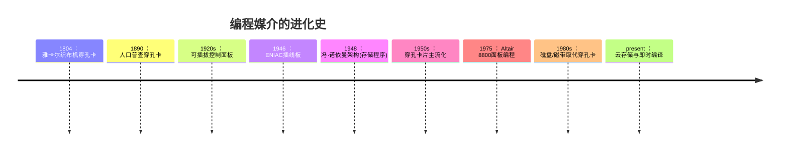

# 计算机科学速成课 Crash Course Computer Science

## 第九集 程序如何进入计算机（How Computer Programs Get Loaded）

---

### **核心问题：程序如何"进入"计算机？**
- **常见误解**：程序"神奇地"出现在内存中
- **现实真相**：程序需要**物理加载机制**，这是计算机发展史的关键挑战
- **关键突破**：从**物理编程**到**存储程序**的范式转变

> 💡 **Carrie Anne 的洞见**：  
> *"给计算机输入程序的问题，比发明计算机本身更早出现——  
> 1804年的织布机，已经用'穿孔卡片'实现了'编程'！"*

---

### **编程的起源：从纺织业到人口普查**
#### 1. **雅卡尔织布机（1804年）**
   - **问题**：如何让织布机自动编织复杂图案？
   - **解决方案**：**穿孔卡片**控制经线升降
     - 卡片孔位 → 决定横线（纬线）从上/下穿过
     - 卡片序列 → 形成**图案指令流**
   - **历史意义**：
     - 首次实现**可更换程序**（更换卡片序列即可改变图案）
     - 被公认为**最早的编程形式**

#### 2. **1890年美国人口普查**
   - **问题**：手工统计6200万人口数据效率低下
   - **解决方案**：赫尔曼·霍尔瑞斯的**穿孔卡片制表机**
     - 每张卡片 = 1个人的完整数据（种族/婚姻状况等）
     - 卡片孔位 = 特定答案（如"已婚"位置打孔）
   - **工作原理**：
     ```mermaid
     graph LR
     A[穿孔卡片] --> B{卡片插入制表机}
     B -->|有孔| C[对应计数器+1]
     B -->|无孔| D[计数器不变]
     C --> E[最终生成统计报告]
     ```
   - **局限**：仅能执行**固定功能**（统计），**不可编程**

---

### **早期编程的进化：从插线板到存储程序**
#### 1. **插线板编程（1920s-1940s）**
   - **原理**：通过**物理连线**配置计算流程
     - 控制面板布满插孔
     - 程序员用线连接不同功能模块
   - **典型案例**：
     - **IBM 402会计机**：盈亏计算需复杂布线
     - **ENIAC（1946）**：世界首台通用电子计算机
       - 编程需**3周时间**重新布线
       - "程序" = 一捆实体电线
   - **致命缺陷**：
     - 硬件停机时间长（换程序=重接线）
     - 编程复杂度高（需理解硬件细节）

#### 2. **革命性突破：冯·诺依曼架构（1945）**
   - **核心思想**：**程序与数据统一存储**
     - 内存同时存放指令+数据
     - CPU从内存读取指令执行
   - **五大组件**：
     1. 算术逻辑单元（ALU）
     2. 数据寄存器
     3. 指令寄存器
     4. 指令地址寄存器
     5. 统一内存（存程序+数据）
   - **划时代意义**：
     - ✅ **程序可快速切换**（无需重接线）
     - ✅ **程序可自我修改**（数据即指令）
     - ✅ **奠定现代计算机基础**（你正在用的设备仍是此架构）

#### 3. **首台实现：曼彻斯特"Baby"（1948）**
   - 世界首台**存储程序计算机**
   - 内存容量：**32×32位**（仅128字节！）
   - 首个程序：寻找2^36的最大因数
   - **验证了冯·诺依曼架构可行性**

---

### **穿孔卡片时代：程序的物理载体**
#### 1. **工作原理**
   - 每张卡片 = 1条指令/1个数据
   - **读卡器**将孔位转换为二进制 → 写入内存
   - 卡片堆叠 → 形成完整程序

#### 2. **操作流程**
   ```mermaid
   sequenceDiagram
     程序员->>穿孔机: 输入代码
     穿孔机->>穿孔卡片: 打孔存储
     穿孔卡片->>读卡器: 插入卡片
     读卡器->>内存: 逐张读取写入
     CPU->>内存: 执行程序
   ```

#### 3. **现实挑战**
| 问题         | 具体影响                     | 应对方案                 |
| ------------ | ---------------------------- | ------------------------ |
| 卡片散落     | 62,500张SAGE系统需数周重排   | **斜条标记**（striping） |
| 程序规模     | 5MB数据需卡车运输            | 分批处理                 |
| 错误修正     | 修改需重新打孔整叠卡片       | 备份卡片集               |
| **典型案例** | 美国空军SAGE防空系统（1955） | 62,500张卡片 = 5MB       |

#### 4. **穿孔纸带：连续化改进**
   - 将离散卡片连成**连续纸带**
   - 优势：更紧凑、更易自动化处理
   - 应用：电报系统、早期计算机输入

---

### **面板编程：早期家用计算机的交互方式**
#### 1. **Altair 8800（1975）：家用计算机先驱**
   - **价格**：$400（组件版）≈ $2,000（2017年）
   - **编程方式**：
     1. 拨动**8位开关**输入二进制指令
     2. 按 **DEPOSIT** 存入内存
     3. 重复输入后续指令
     4. 按 **RUN** 执行，观察指示灯

#### 2. **编程流程示例**
   ```
   1. 设置开关: 0010 1110 (LOAD_A 14)
   2. 按 DEPOSIT → 写入地址0
   3. 设置开关: 0001 1111 (LOAD_B 15)
   4. 按 DEPOSIT → 写入地址1
   5. ...（重复至程序完成）
   6. 开关拨回0 → 按 RUN
   7. 观察指示灯闪烁执行
   ```

#### 3. **时代局限性**
   - **仅限专家**：需记忆操作码和寄存器
   - **极易出错**：单个位错误导致程序崩溃
   - **效率低下**：输入100行程序需数小时

---

### **关键转折：为什么需要编程语言？**
#### 1. **早期编程的三大痛点**
| 问题           | 影响               | 比喻               |
| -------------- | ------------------ | ------------------ |
| **硬件依赖**   | 程序员需懂电路细节 | 建房子前要先造砖   |
| **二进制输入** | 易错且效率低下     | 用摩斯密码写小说   |
| **无抽象层**   | 无法复用代码       | 每次开车都要造引擎 |

#### 2. **行业现状（1970s前）**
   - 即使专业工程师也**难以发挥计算机潜力**
   - 计算机使用率低下（昂贵硬件+编程门槛高）
   - **迫切需求**：更接近人类思维的编程方式

> 💡 **Carrie Anne 的总结**：  
> *"从织布机穿孔卡到Altair 8800的开关，  
> 人类花了170年让'编程'从物理操作变成抽象思维——  
> 而编程语言，将彻底解放人类创造力！"*

---

### **技术演进全景图**


---

### **思考启示：抽象层级的哲学意义**
1. **物理层 → 逻辑层的飞跃**  
   - 穿孔卡：程序 = **物理存在**（孔/无孔）  
   - 存储程序：程序 = **抽象数据**（0/1序列）  
   - **本质突破**：程序从"硬件配置"变为"可操作对象"

2. **冯·诺依曼架构的深层影响**  
   - 允许**程序生成程序**（编译器/解释器基础）  
   - 使**操作系统**成为可能（管理程序的程序）  
   - 催生**软件产业**（脱离硬件的独立产业）

3. **历史对现代的启示**  
   - 今天**云计算**本质仍是冯·诺依曼架构  
   - **AI训练**仍需解决"数据输入"问题（类似穿孔卡挑战）  
   - 每次**交互方式革新**（GUI/语音/AR）都在降低编程门槛

---

**下集预告**：深入探讨 **"编程语言的诞生与发展"**，揭秘人类如何用`if/else`和`for`循环，将计算机从专家玩具变为全民工具！