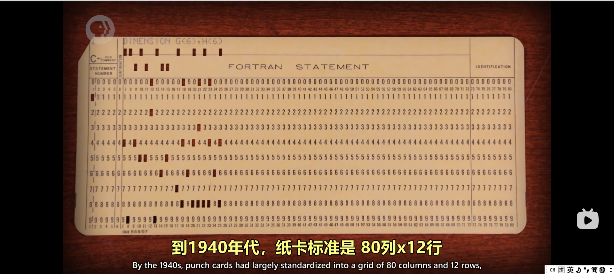
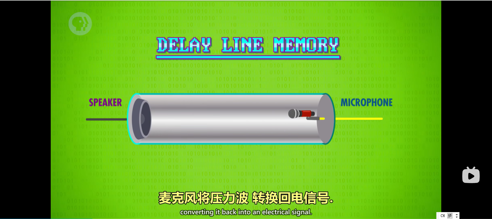
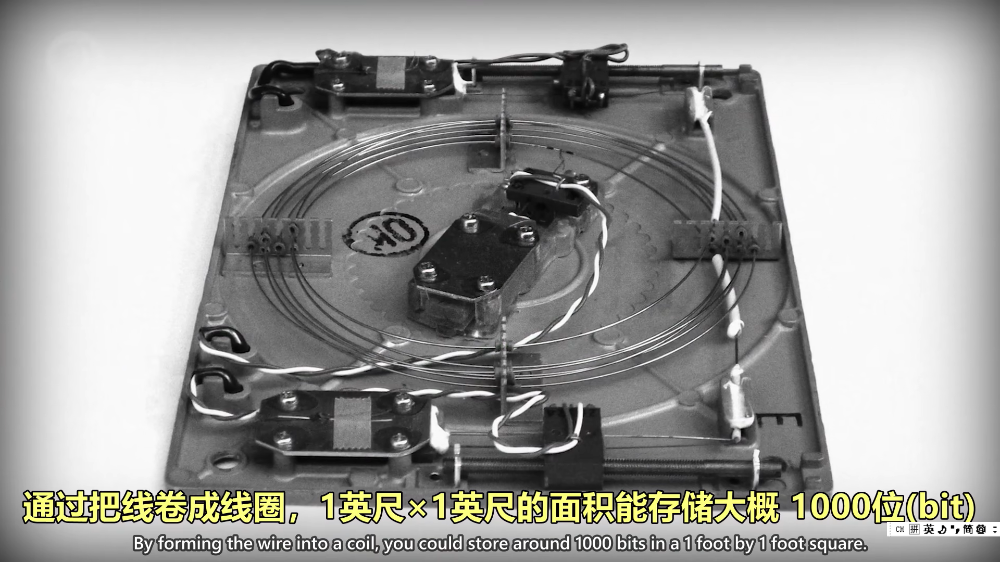
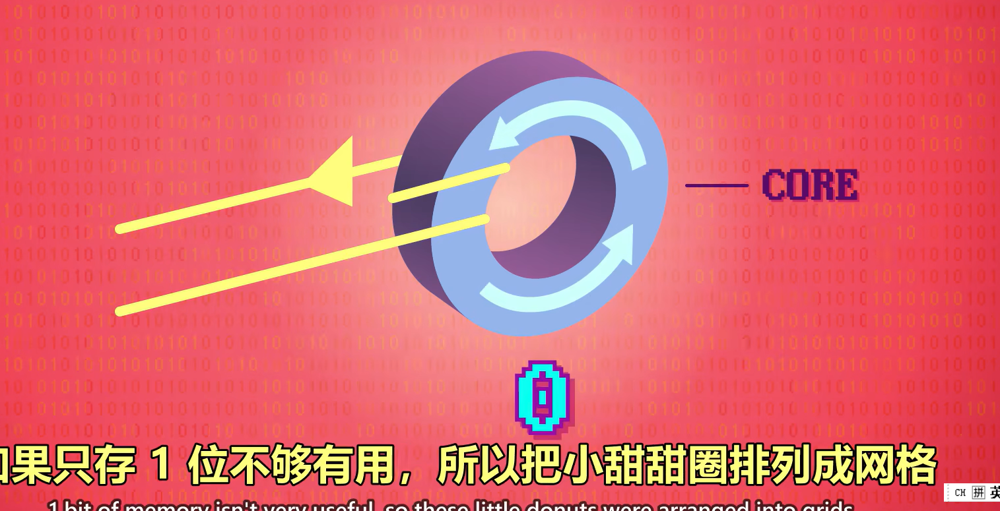
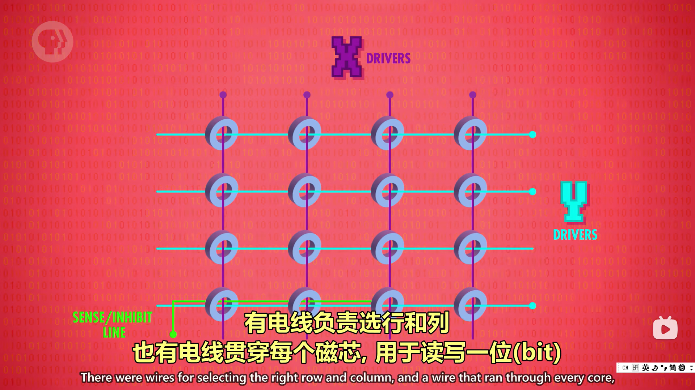
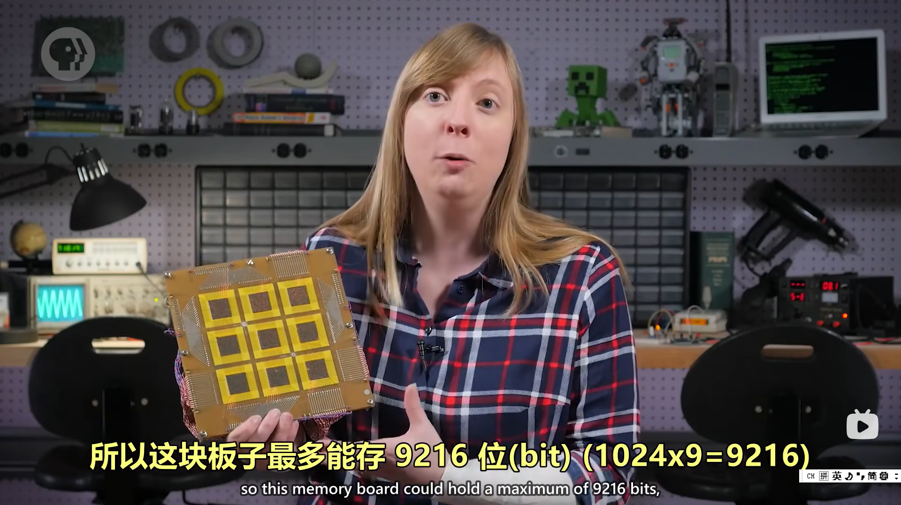
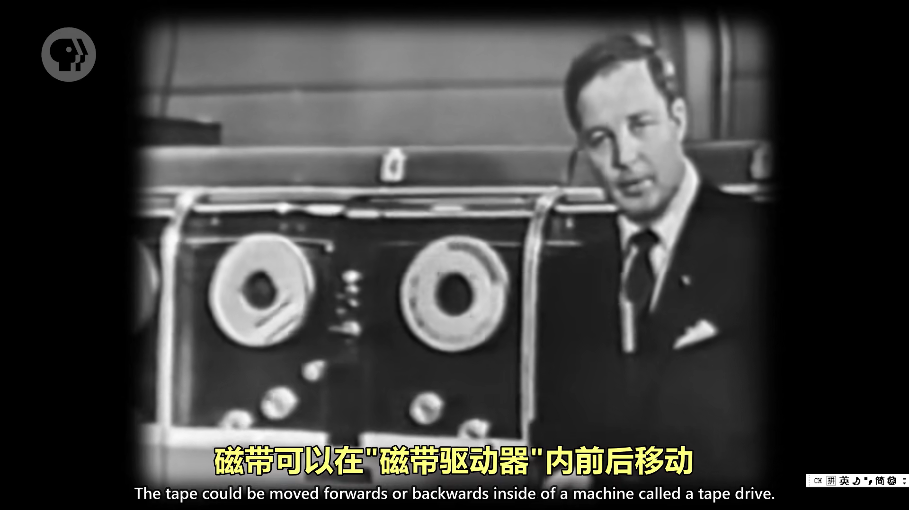
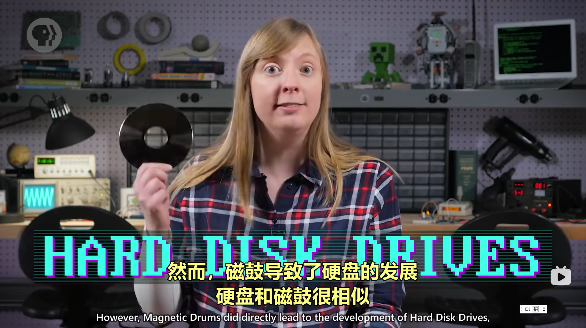
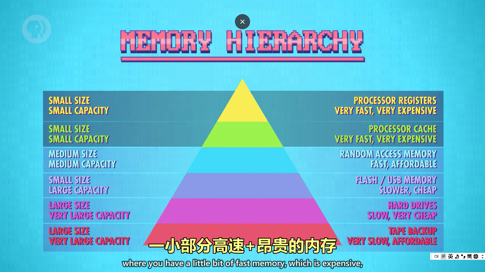

# 计算机科学速成课 Crash Course Computer Science

## 第十九集 内存与存储介质（Memory & Storage）

---

### **核心目标：区分内存(Memory)与存储(Storage)的本质差异**
- **问题起点**：混淆"内存"和"存储"导致对计算机工作原理理解不清
- **关键突破**：理解**易失性**与**非易失性**存储的根本区别
- **核心理念**：**内存**用于临时处理，**存储**用于长期保留

> 💡 **Carrie Anne 的洞见**：  
> *"内存是计算机的'短期记忆'，  
> 存储是它的'长期记忆'——  
> 拔掉电源时，短期记忆消失，  
> 但长期记忆依然存在！"*
> 

---

### **基本概念：内存 vs 存储**


#### 1. **内存 (Memory)**
   - **特性**：
     - ✅ **易失性**（Volatile）：断电后数据丢失
     - ✅ **速度快**：CPU直接访问
     - ✅ **临时性**：运行时程序和数据
   - **典型代表**：RAM（随机存取存储器）
   - **现实类比**：人的短期记忆（如解题时的思考过程）

#### 2. **存储 (Storage)**
   - **特性**：
     - ✅ **非易失性**（Non-volatile）：断电后数据保留
     - ✅ **容量大**：长期保存数据
     - ✅ **速度慢**：需通过I/O系统访问
   - **典型代表**：硬盘、SSD、磁带
   - **现实类比**：人的长期记忆（如生日、重要事件）

#### 3. **关键区别**
| 特性       | 内存(Memory)   | 存储(Storage)  |
| ---------- | -------------- | -------------- |
| **持久性** | 断电丢失       | 断电保留       |
| **速度**   | 极快（纳秒级） | 较慢（毫秒级） |
| **用途**   | 运行时临时数据 | 长期保存数据   |
| **成本**   | 高（每GB贵）   | 低（每GB便宜） |
| **容量**   | 较小（GB级）   | 较大（TB级）   |

> ✅ **关键提示**：现代技术模糊了界限（如SSD速度接近RAM），但概念区别依然重要

---

### **存储技术演进史**
#### 1. **早期技术（1940s-1950s）**

最早的存储介质是打孔纸卡，以及纸卡的亲戚 打孔纸带




每一张卡 能存 960 位数据 （80 * 12 =960），对于存临时值，纸卡不好用 

随机存取存储器 可以随时访问任何位置

| 技术                                    | 工作原理           | 特点                  | 局限                                                         |
| --------------------------------------- | ------------------ | --------------------- | ------------------------------------------------------------ |
| **延迟线存储器**<br>(Delay Line Memory) | 液体管中压力波传输 | 1944年发明，ENIAC使用 | 顺序访问，密度低，易混（每一个时刻只能读一位bit数据）顺序存储器 |
| **磁芯存储器**<br>(Magnetic Core)       | 磁化小磁环表示0/1  | 非易失性，1950s主流   | 1950s：1MB≈$40万，速度慢                                     |
| **磁带**<br>(Magnetic Tape)             | 磁性材料记录数据   | 1951年UNIVAC引入      | 顺序访问，必须快进/倒带                                      |
| **磁鼓存储器**<br>(Magnetic Drum)       | 旋转圆筒+读写头    | 1950-60s流行          | 直接导致硬盘发展                                             |
















   - **磁芯存储器细节**：
     - 每个磁芯 = 1位数据
     - 通过电流方向控制磁化方向
     - 1950年代1MB ≈ 40万美元（现代≈$4百万）
     - 顺序/循环访问（无法随机访问）
   - **磁带细节**：
     - UNIVAC：半英寸宽，8条并行轨道
     - 每英寸128位 → 每卷1200英尺 ≈ 2MB
     - 至今仍用于数据归档（便宜、紧凑）

#### 2. **磁盘时代（1956-2000s）**
| 技术                                 | 突破                | 特点                    | 演进                     |
| ------------------------------------ | ------------------- | ----------------------- | ------------------------ |
| **硬盘驱动器**<br>(Hard Disk Drives) | 1956年IBM RAMAC 305 | 50张24英寸磁盘，5MB容量 | 1956→2023：容量增100万倍 |
| **软盘**<br>(Floppy Disks)           | 1970s便携存储       | 磁性介质，"软"盘片      | 1970s-1990s主流便携存储  |
| **光盘**<br>(Optical Disks)          | 表面物理凹坑        | CD/DVD/Blu-ray          | 反射光不同→解码为0/1     |

   - **硬盘工作原理**：
     ```mermaid
     graph LR
     A[磁盘旋转] --> B[读写头定位]
     B --> C[等待正确区域旋转到位]
     C --> D[读写数据]
     ```
     - **寻道时间**（Seek Time）：读写头移动+等待时间
       - RAMAC 305：0.6秒
       - 现代硬盘：<0.01秒

   - **软盘特点**：
     - 1970s-1990s便携存储主流
     
     - 保存图标源自软盘形象
     
     - 逐渐被USB闪存取代
     
       

#### 3. **固态时代（2000s-至今）**
| 技术                            | 原理         | 优势               | 应用          |
| ------------------------------- | ------------ | ------------------ | ------------- |
| **SSD**<br>(Solid State Drives) | 集成电路存储 | 无移动部件，速度快 | 替代传统硬盘  |
| **USB闪存**                     | 闪存芯片     | 便携，耐用         | 日常数据传输  |
| **NAND闪存**                    | 浮栅晶体管   | 非易失性，可重写   | 手机/相机存储 |

   - **固态存储优势**：
     - ✅ **无机械部件**：更耐用，抗震动
     - ✅ **无寻道延迟**：随机访问速度极快
     - ✅ **能耗低**：适合移动设备
     - ✅ **体积小**：可集成到各种设备
   - **成本演进**：
     - 1972年：RAM集成电路 1美分/比特
     - 2023年：SSD约 $0.05/GB（比1950s便宜10亿倍）

> 💡 **Carrie Anne 的对比**：  
> *"1956年IBM RAMAC 305的5MB硬盘重达一吨——  
> 而如今，一张SD卡可存512GB，  
> 比RAMAC容量大10万倍，重量却不到1克！"*

---

### **存储技术关键指标**
#### 1. **访问方式**
| 类型                                | 工作原理           | 速度 | 代表技术 |
| ----------------------------------- | ------------------ | ---- | -------- |
| **随机访问**<br>(Random Access)     | 直接定位任意位置   | 快   | RAM, SSD |
| **顺序访问**<br>(Sequential Access) | 必须按顺序到达目标 | 慢   | 磁带     |
| **循环访问**<br>(Cyclic Access)     | 数据循环流动       | 中   | 早期内存 |

#### 2. **性能指标**
| 指标         | 定义             | 典型值                                | 重要性         |
| ------------ | ---------------- | ------------------------------------- | -------------- |
| **容量**     | 可存储数据量     | 硬盘：2-20TB<br>SSD：512GB-4TB        | 基础需求       |
| **读写速度** | 数据传输速率     | HDD：100-200MB/s<br>SSD：500-7000MB/s | 影响用户体验   |
| **寻道时间** | 定位数据所需时间 | HDD：5-10ms<br>SSD：0.08-0.16ms       | 随机访问性能   |
| **耐用性**   | 读写寿命         | HDD：无限<br>SSD：约300-3000次/块     | 特别对闪存重要 |

#### 3. **成本效益分析**
   ```mermaid
   graph LR
   A[需求] -->|需要快速访问| B[SSD]
   A -->|大容量归档| C[磁带]
   A -->|平衡成本/速度| D[HDD]
   A -->|便携性| E[USB/SD卡]
   ```

---

### **现代存储层次结构**
#### 1. **存储金字塔**
   ```mermaid
graph TD
    A["寄存器(最快，最小)"] --> B["CPU缓存(L1/L2/L3)"]
    B --> C["主内存(RAM)"]
    C --> D["固态存储(SSD)"]
    D --> E["机械硬盘(HDD)"]
    E --> F["磁带/云存储(最慢，最大)"]
   ```

#### 2. **各层特点**
| 层级        | 速度 | 容量 | 价格(每GB) | 用途            |
| ----------- | ---- | ---- | ---------- | --------------- |
| **寄存器**  | 纳秒 | 几KB | 极高       | CPU内部操作     |
| **CPU缓存** | 纳秒 | 几MB | 高         | 热点数据        |
| **RAM**     | 纳秒 | GB级 | 中高       | 运行时数据      |
| **SSD**     | 微秒 | TB级 | 中         | 系统盘/常用程序 |
| **HDD**     | 毫秒 | 多TB | 低         | 大文件存储      |
| **磁带/云** | 秒级 | PB级 | 极低       | 长期归档        |

#### 3. **工作原理**
   - **局部性原理**：
     - **时间局部性**：最近访问的数据可能再次访问
     - **空间局部性**：访问某位置后，附近位置可能被访问
   - **缓存策略**：
     - 热点数据放入高速存储层
     - 冷数据移至低速存储层
     - 操作系统自动管理数据迁移

> ✅ **关键启示**：现代系统使用**多层存储**平衡速度、容量和成本

---

### **技术趋势与未来方向**
#### 1. **当前趋势**
   - **SSD普及**：价格持续下降，逐渐替代HDD
   - **3D NAND**：垂直堆叠闪存单元，提升密度
   - **NVMe协议**：优化SSD性能，减少延迟
   - **混合存储**：SSD缓存+HDD存储，平衡成本性能

#### 2. **新兴技术**
| 技术          | 原理         | 潜力                     | 挑战       |
| ------------- | ------------ | ------------------------ | ---------- |
| **3D XPoint** | 相变存储     | 速度接近DRAM<br>非易失性 | 成本高     |
| **MRAM**      | 磁阻随机存储 | 非易失性<br>无限写入     | 密度低     |
| **ReRAM**     | 电阻式RAM    | 低功耗<br>高密度         | 可靠性     |
| **DNA存储**   | 生物分子编码 | 极高密度<br>极长保存     | 读写速度慢 |

#### 3. **可持续性挑战**
   - **电子垃圾**：全球每年5000万吨
   - **能源消耗**：数据中心占全球电力2-3%
   - **制造污染**：半导体制造涉及有毒物质
   - **解决方案**：
     - 提高存储效率（压缩、去重）
     - 发展绿色数据中心
     - 延长设备使用寿命

---

### **思考与延伸**
#### 1. **摩尔定律与存储技术**
   - 存储密度增长比摩尔定律更快
   - "基辛格定律"：硬盘容量每18个月翻倍
   - 但物理极限正在逼近（磁记录超顺磁极限）

#### 2. **云存储的本质**
   - 云存储 = 他人管理的HDD/SSD集群
   - 优势：可扩展性、可靠性、维护简单
   - 挑战：隐私、安全、网络依赖

#### 3. **存储技术的社会影响**
   - **数据民主化**：低成本存储使个人也能保存大量数据
   - **历史记录**：数字档案比纸质更持久
   - **隐私挑战**：数据永久保存导致隐私风险

#### 4. **未来存储场景**
   - **全息存储**：三维空间存储数据
   - **量子存储**：利用量子态存储信息
   - **生物存储**：DNA等生物分子作为存储介质

> ✅ **Carrie Anne 的总结**：  
> *"从水银延迟线到纳米级闪存，  
> 人类将信息密度提高了10亿倍——  
> 但真正的革命不是技术本身，  
> 而是它如何改变了我们保存、分享和思考的方式！  
> 下次当你点击'保存'时，  
> 请记住这背后70年的创新历程！"*

---

**下集预告**：深入探讨 **"文件系统"** ——揭秘计算机如何组织、存储和检索海量数据，以及"格式化"究竟发生了什么！