# 计算机科学速成课 Crash Course Computer Science

## 第二十集 文件系统（Files & File Systems）

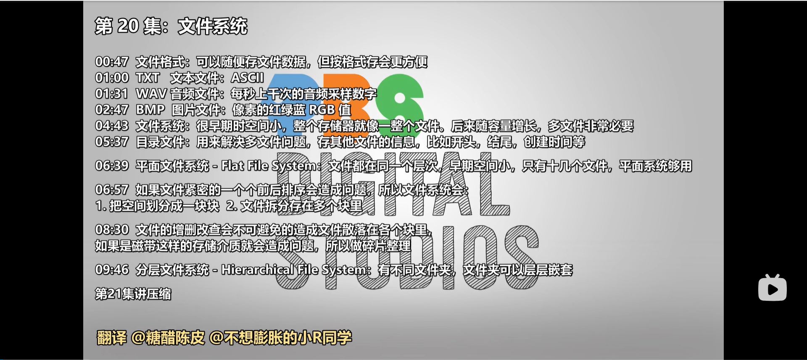 

---

### **核心目标：理解文件系统如何组织和管理存储数据**
- **问题起点**：存储设备本身只是一堆比特（bits），没有文件的概念
- **关键突破**：文件系统作为**抽象层**，将原始比特组织成可管理的文件
- **核心理念**：**文件系统**是用户与原始存储之间的桥梁，让数据变得可组织、可访问

> 💡 **Carrie Anne 的洞见**：  
> *"文件系统不是存储设备的'配件'，  
> 而是让存储设备变得有用的'灵魂'——  
> 没有它，硬盘只是一块会发光的金属板！"*
>
> 随便排列文件数据完全没问题，但按格式排会更好 File format
>
> 波形 Wave文件，也叫WAV，它存音频数据
> 在正确读取数据前，需要知道一些信息 ，比如 码率 bit rate 以及单声道还是立体声
>
> Data about Data is called Metadata 元数据 关于数据的数据
>
> 元数据 存在文件开头，在实际数据前面，因此也叫文件头（Header)
>
> 数字代表每秒捕获多次的声音幅度
>
> 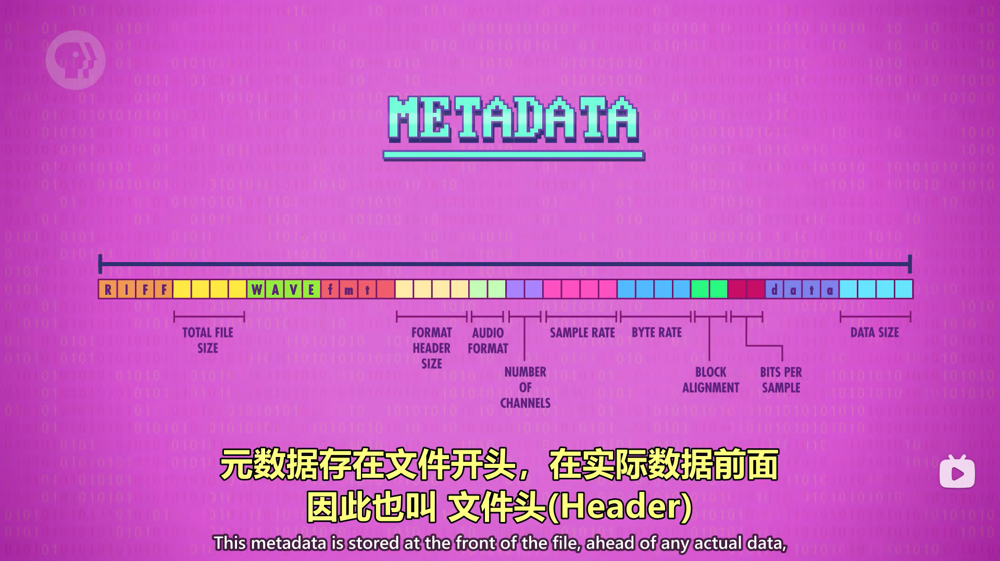
>
> 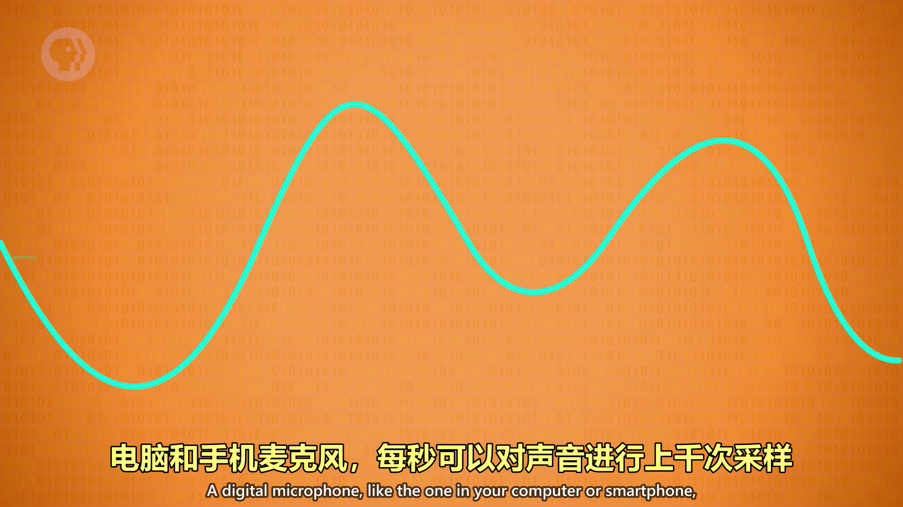
>
> 位图bitmap，后缀.bmp 存图片
>
> 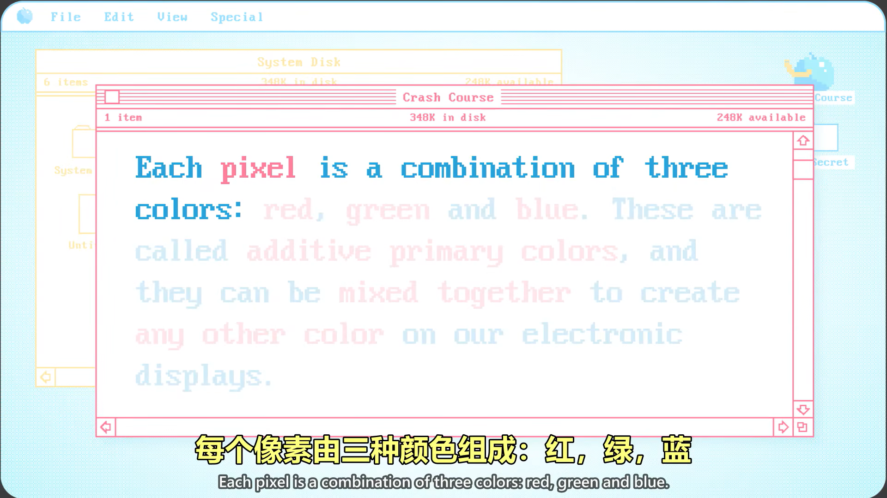
>
> 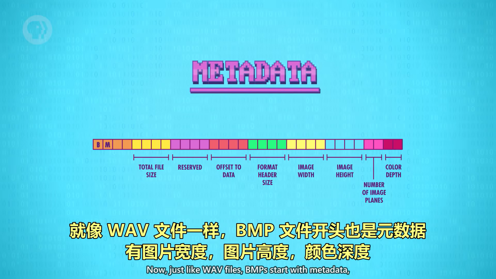
>
> 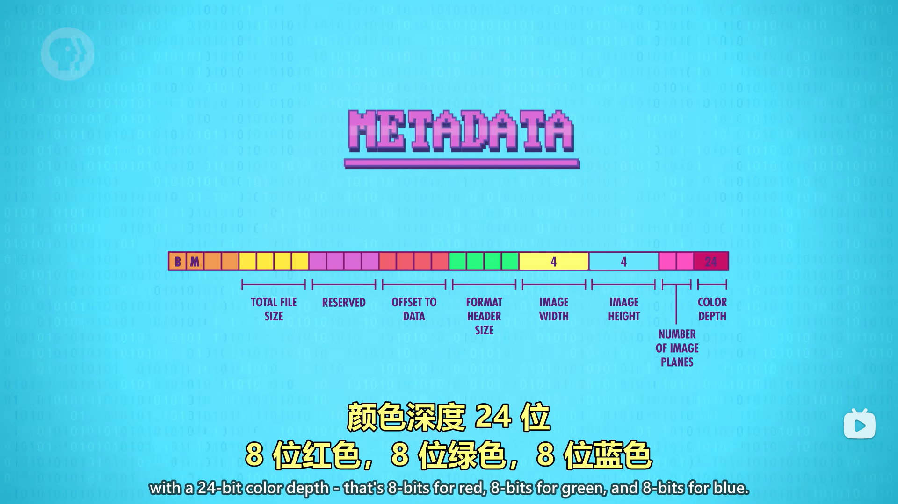
>
> 提醒一下 8位bit 和1字节 byte是一回事0~255
>
> 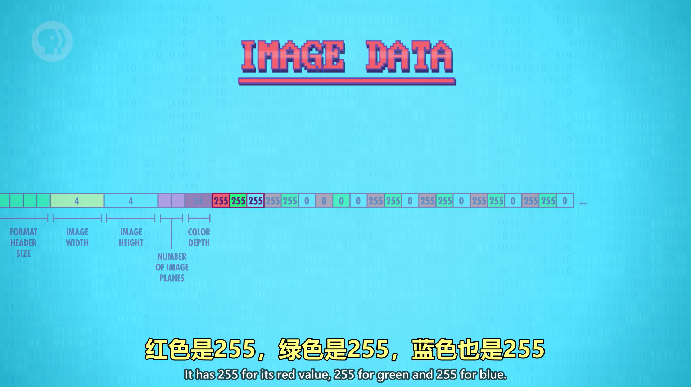
>
> 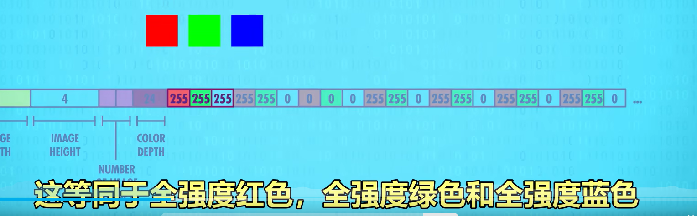
>
> 混合在一起变成白色

---

### **文件系统基础：从原始比特到可管理文件**
#### 1. **存储设备的本质**
   - **原始状态**：==仅是一长串比特（bits）的集合==
   - **问题**：存储设备**没有文件概念**，只是存储大量比特的机制
   - **早期解决方案**：整个存储当作**一个大文件**
     - 适用于单一任务计算机（如计算火炮射程表）
     - 数据从存储开始位置顺序填充

#### 2. **文件系统的核心功能** 为了知道文件是说明 文件格式至关重要

一排能存储数据的桶

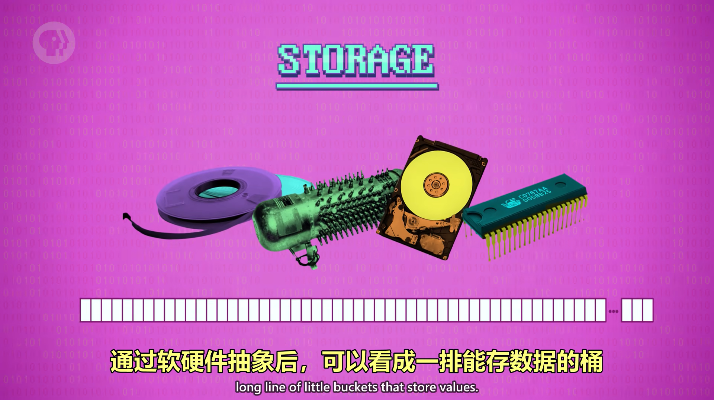

| 功能           | 说明                     | 类比                           |
| -------------- | ------------------------ | ------------------------------ |
| **文件抽象**   | 将原始比特组织成逻辑文件 | 书架将散乱书籍组织成有序书架   |
| **元数据管理** | 存储创建时间、权限等信息 | 书籍标签记录作者、出版日期     |
| **空间分配**   | 管理存储空间使用         | 图书馆管理员安排书籍位置       |
| **目录结构**   | 组织文件层次             | 图书馆分类系统（文学、科学等） |

#### 3. **文件系统的工作原理**

目录文件： 为了存多个文件，需要一个特殊文件，记录其他文件的位置 ，**放在开头方便找**

目录文件，存其他所有文件的名字。

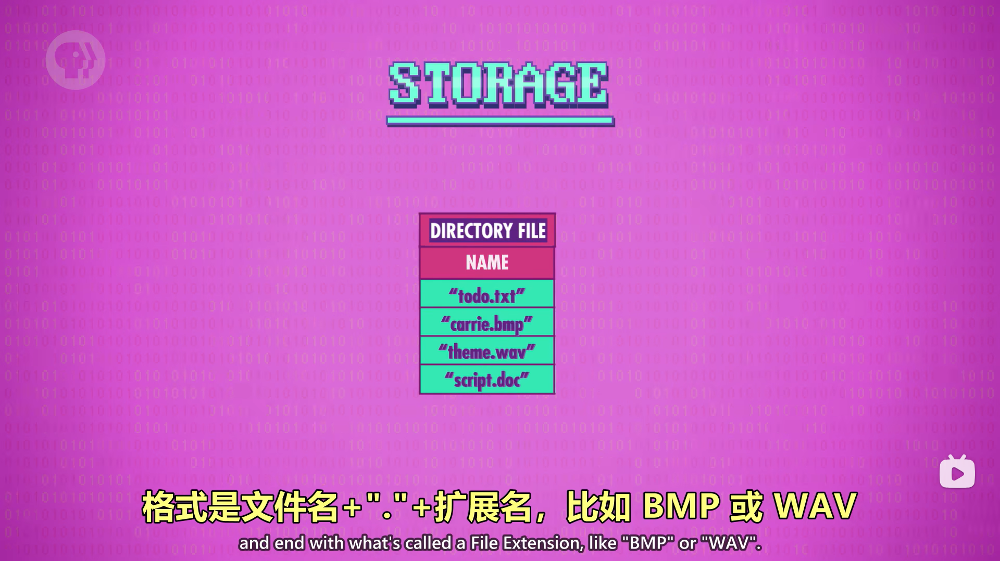

扩展名帮助知道文件类型，目录文件还存文件的元数据，比如创建时间，最后修改时间，文件所有者是谁，是否能读写或 读写都行，

最重要的是 目录文件有文件的起始位置和长度

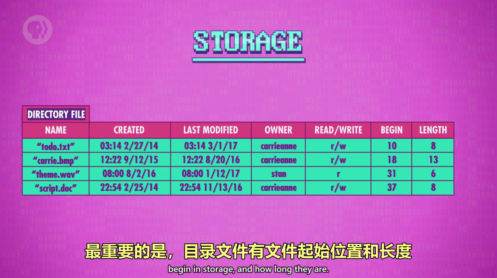

这个例子叫做 平面 文件系统 Flat File system 平面文件系统 因为文件都在同一个层次

前后排的问题： 加一点数据可能会覆盖后面的

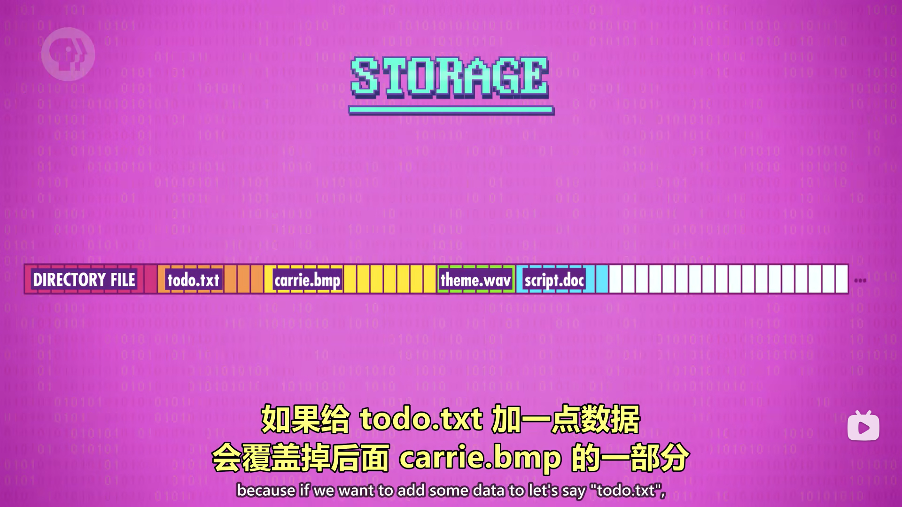

>  如何解决？
>
> 1. 把空间划分成一块块 导致有一些预留空间可以方便改动，方便管理
>
>    文件目录要记录文件在那些块里
>    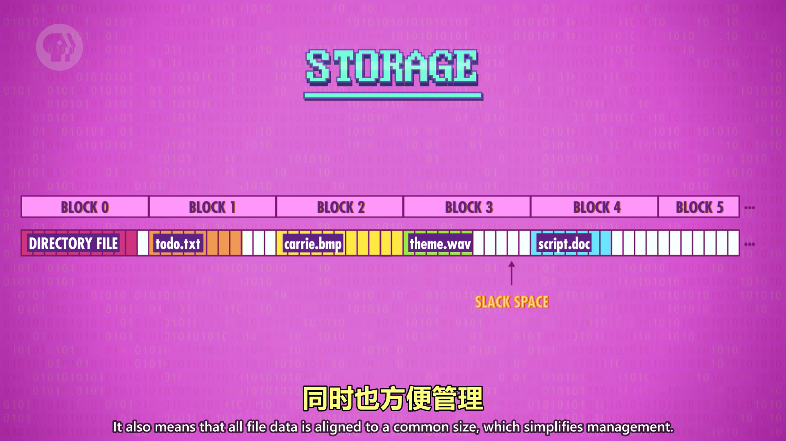
>
> 2. 拆分文件，存在多个块里
>    目录文件会记录不只一个块，而是多个块 block 很像虚拟内存
>
>    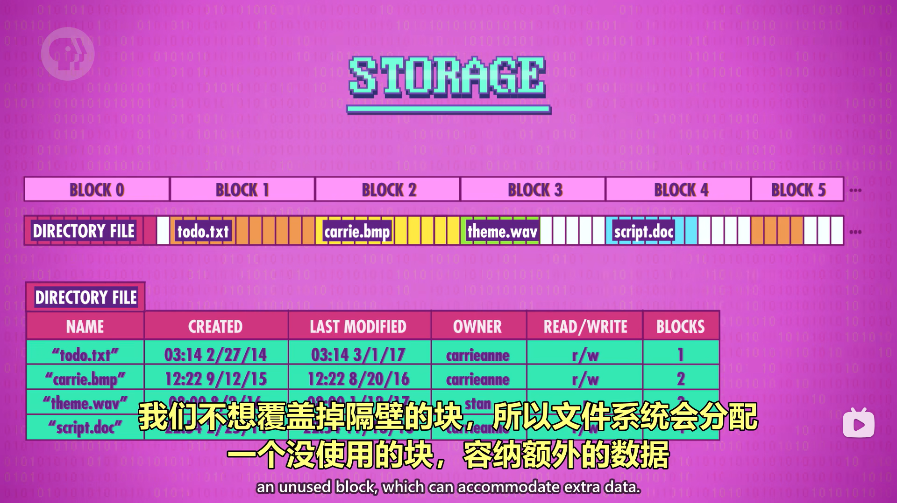
>
>    仅从目录文件移除记录，**不擦除实际数据**
>    todo.txt 在三个块里 ，隔开了，顺序也是乱的，这就是碎片 fragmentation
>    碎片是增删改文件导致的，不可避免
>    对于很多存储技术来说，碎片是坏事  eg 磁带
>    碎片整理
>
>    

   ```mermaid
   graph LR
   A[原始存储设备] --> B[文件系统]
   B --> C[目录文件]
   C --> D[文件元数据]
   C --> E[文件位置]
   D --> F[文件名称]
   D --> G[创建/修改时间]
   D --> H[访问权限]
   E --> I[存储块位置]
   ```

> ✅ **关键价值**：文件系统使用户无需关心数据在磁盘上的物理位置

---

### **目录文件：文件系统的"大脑"**
#### 1. **基本结构与功能**
   - **位置**：通常位于存储设备的**起始位置**（位置0）
   - **内容**：
     - 所有文件的**名称**
     - **文件扩展名**（如`.bmp`, `.wav`）标识文件类型
     - **元数据**：创建时间、最后修改时间、所有者、访问权限
     - **存储位置**：文件在存储中的起始位置和长度
   - **类比**：书的**目录**，记录章节位置

#### 2. **目录文件的操作**
| 操作           | 实现方式             | 注意事项                       |
| -------------- | -------------------- | ------------------------------ |
| **创建文件**   | 在目录文件添加新条目 | 需指定文件名和初始大小         |
| **删除文件**   | 从目录文件移除条目   | **不删除实际数据**，仅移除记录 |
| **重命名文件** | 更新目录文件中的名称 | 保持文件数据位置不变           |
| **移动文件**   | 更新目录文件中的位置 | 层次化文件系统中更复杂         |

#### 3. **文件恢复原理**
   - **删除操作**：仅从目录文件移除记录，**不擦除实际数据**
   - **恢复可能性**：在数据被新内容覆盖前，可通过特殊工具读取
   - **取证应用**：计算机取证团队利用此特性"恢复"已删除数据
   - **安全提示**：要真正删除敏感数据，需使用**安全擦除工具**覆盖数据

> 💡 **Carrie Anne 的提醒**：  
> *"删除文件就像撕掉书的目录页——  
> 书的内容还在，只是你不知道在哪里找！"*

---

### **存储组织：块与碎片管理**
#### 1. **块（Blocks）概念**
   - **定义**：存储设备被划分为**固定大小**的单元
   - **优势**：
     - ✅ **简化管理**：所有文件数据对齐到共同大小
     - ✅ **高效分配**：易于跟踪空闲空间
     - ✅ **减少碎片**：统一大小便于重用
   - **典型大小**：512字节到4KB（取决于文件系统）

#### 2. **文件存储机制**
   - **单块文件**：小文件可完全存储在一个块内
   - **多块文件**：大文件被**拆分**并存储在多个块中
     - 目录文件记录文件在哪些块中
     - 操作系统负责**重组**文件内容
   - **类比**：拼图游戏，文件是完整图片，块是拼图片

#### 3. **文件碎片（Fragmentation）**
   - **形成原因**：**文件被创建、删除和修改的必然结果**
   - **表现**：文件分散存储在**不连续**的块中
   - **影响**：
     - **磁盘**：增加寻道时间，降低读写速度
     - **磁带**：需来回寻找，严重降低性能
       ```
       读取碎片化文件：块1 → 快进到块5 → 倒回到块3
       ```
   - **解决方案**：**碎片整理**（Defragmentation）
     - 将文件块重新排列为**连续存储**
     - 例：`todo.txt` 从块1、5、3 → 重组为块1、2、3
     - 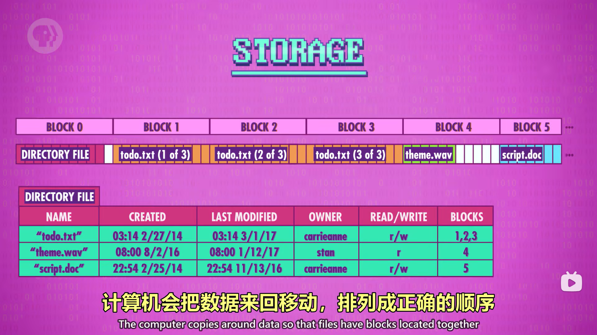

#### 4. **碎片管理策略**
| 策略               | 说明                     | 适用场景     |
| ------------------ | ------------------------ | ------------ |
| **预分配**         | 为文件预留连续空间       | 大型媒体文件 |
| **碎片整理**       | 定期重组文件             | 传统硬盘     |
| **日志式文件系统** | 记录操作减少碎片         | 现代文件系统 |
| **SSD优化**        | 避免碎片整理（减少写入） | 固态硬盘     |

> ✅ **关键启示**：文件碎片是**不可避免**的，但可通过设计减少影响

---

### **文件系统演进：从平面到层次化**
#### 1. **平面文件系统（Flat File System）**
   - **特点**：所有文件存储在**单一层次**
   - **优势**：简单、高效（文件少时）
   - **局限**：
     - 文件数量受限（通常<100）
     - 缺乏组织性（难以管理大量文件）
     - 无法创建逻辑分组
   - **适用场景**：早期计算机（存储容量小）

#### 2. **层次化文件系统（Hierarchical File System）** 分层文件系统
   - **核心思想**：**目录可包含子目录**，形成树状结构
        - 最大的变化，目录文件不仅指向文件，还要指向目录
        - 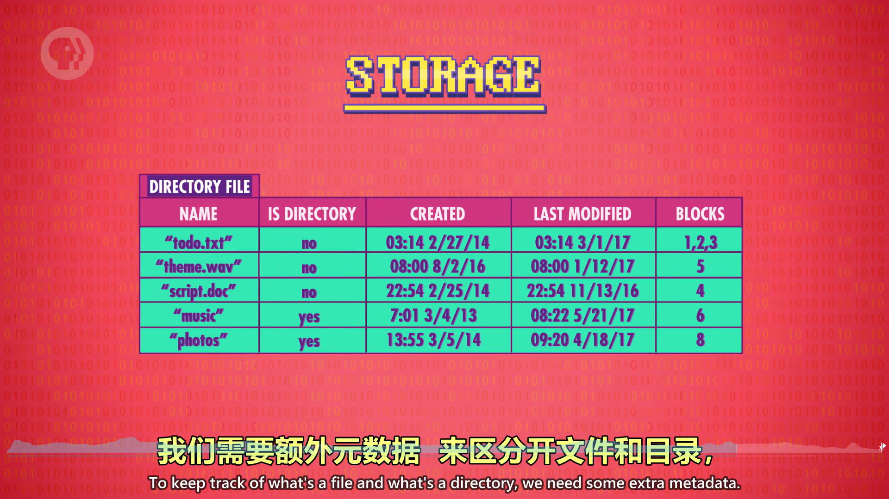
   - **实现方式**：
     - 每个目录有自己的**目录文件**
     - 目录文件格式与根目录相同
     - 通过**路径**标识文件位置（如`/music/song.mp3`）
   - **优势**：
     - ✅ **无限深度**：可创建任意层级的目录结构
     - ✅ **逻辑分组**：按主题/类型组织文件
     - ✅ **灵活移动**：轻松重定位文件和目录
     - ✅ **权限管理**：可为不同目录设置不同权限

#### 3. **层次化文件系统示例**
   ```
   /
   ├── todo.txt
   ├── carrie.bmp
   ├── notes.txt
   ├── music/
   │   ├── song1.mp3
   │   └── song2.mp3
   └── photos/
       ├── vacation.jpg
       └── family.png
   ```
   - **根目录**：包含3个文件和2个子目录
   - **音乐目录**：包含2首歌曲
   - **照片目录**：包含2张图片

#### 4. **路径解析过程**
   ```mermaid
   sequenceDiagram
     用户->>文件系统: 请求 /music/song1.mp3
     文件系统->>根目录: 读取位置0的目录文件
     根目录-->>文件系统: 返回"music"目录位置
     文件系统->>音乐目录: 读取该位置的目录文件
     音乐目录-->>文件系统: 返回"song1.mp3"位置
     文件系统->>存储设备: 读取文件数据
     存储设备-->>用户: 返回文件内容
   ```

> 💡 **Carrie Anne 的对比**：  
> *"平面文件系统像单间公寓——  
> 所有东西堆在一个房间；  
> 层次化文件系统像多层别墅——  
> 每个房间有特定用途，井井有条！"*

---

### **文件系统类型与现代发展**
#### 1. **常见文件系统**
| 类型      | 特点                   | 适用系统             |
| --------- | ---------------------- | -------------------- |
| **FAT32** | 兼容性好，但单文件<4GB | 旧Windows、USB驱动器 |
| **NTFS**  | 支持大文件、权限、日志 | 现代Windows          |
| **HFS+**  | Apple专用，支持元数据  | 旧macOS              |
| **APFS**  | 优化SSD，加密支持      | 新macOS              |
| **ext4**  | Linux主流，稳定高效    | Linux系统            |
| **exFAT** | 大文件支持，跨平台     | 闪存设备             |

#### 2. **现代文件系统创新**
   - **日志式文件系统**：
     - 记录操作前先写入日志
     - 系统崩溃后可快速恢复
     - 例：NTFS、ext3/4、APFS
   - **写时复制**（Copy-on-Write）：
     - 修改数据时不覆盖原数据
     - 创建新副本，提高可靠性和快照功能
     - 例：ZFS、Btrfs
   - **分布式文件系统**：
     - 跨多台机器管理文件
     - 例：HDFS（Hadoop）、Google File System

#### 3. **SSD专用优化**
   - **避免碎片整理**：SSD无寻道时间，碎片整理反而减少寿命
   - **TRIM命令**：通知SSD哪些块不再使用，提高写入性能
   - **磨损均衡**：均匀分布写入操作，延长SSD寿命

> ✅ **关键趋势**：文件系统正从**存储管理**向**数据服务**演进

---

### **文件系统的现实意义**
#### 1. **用户体验提升**
   - **直观操作**：用户可像操作物理文件一样操作数字文件
   - **无缝迁移**：文件系统抽象使用户无需关心底层存储技术
   - **跨平台兼容**：标准化文件系统促进设备间数据交换

#### 2. **技术影响**
   - **操作系统核心**：文件系统是操作系统的关键组件
   - **应用程序基础**：几乎所有应用都依赖文件系统
   - **数据安全**：权限管理、加密等功能保障数据安全

#### 3. **社会影响**
   - **数字档案**：使个人和组织能长期保存大量数据
   - **知识共享**：简化文件分发和协作
   - **数字遗产**：文件系统影响我们如何保存数字足迹

> 💡 **Carrie Anne 的总结**：  
> *"文件系统是计算史上最伟大的抽象之一——  
> 它让普通人也能驾驭复杂的存储技术，  
> 将原始比特转化为有意义的信息。  
> 下次你点击'保存'或'打开'时，  
> 请记住背后是几十年的创新，  
> 让你的文件既安全又易于访问！"*

---

### **思考与延伸**
#### 1. **文件系统设计的权衡**
   - **性能 vs 可靠性**：日志式文件系统提高可靠性但降低写入速度
   - **简单性 vs 功能**：FAT32简单但功能有限，NTFS功能丰富但复杂
   - **兼容性 vs 创新**：新文件系统需平衡向后兼容与创新功能

#### 2. **未来文件系统趋势**
   - **智能文件系统**：基于AI预测文件访问模式
   - **内容寻址**：按内容而非路径标识文件（如IPFS）
   - **统一命名空间**：融合本地存储与云存储
   - **量子存储优化**：适应新型存储技术

#### 3. **文件系统与虚拟化**
   - **容器技术**：每个容器有独立文件系统视图
   - **虚拟机**：虚拟磁盘文件封装完整文件系统
   - **无服务器计算**：文件系统作为服务提供

#### 4. **可持续性考量**
   - **存储效率**：压缩、去重减少物理存储需求
   - **能耗优化**：减少不必要的磁盘活动
   - **数据生命周期管理**：自动归档不常用数据

---

**下集预告**：深入探讨 **"文件格式"** ——揭秘不同文件类型（文本、图像、视频）如何编码数据，以及为什么有些文件可以跨平台打开，而有些不能！