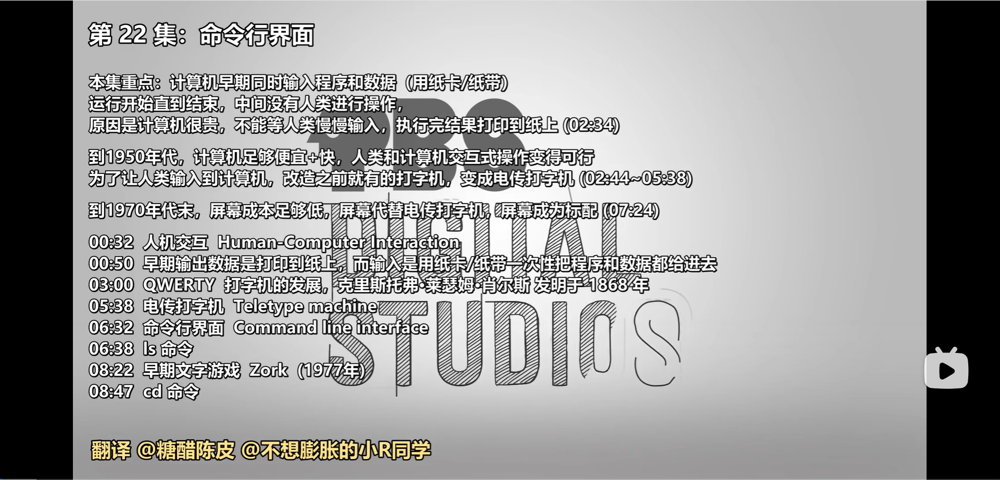
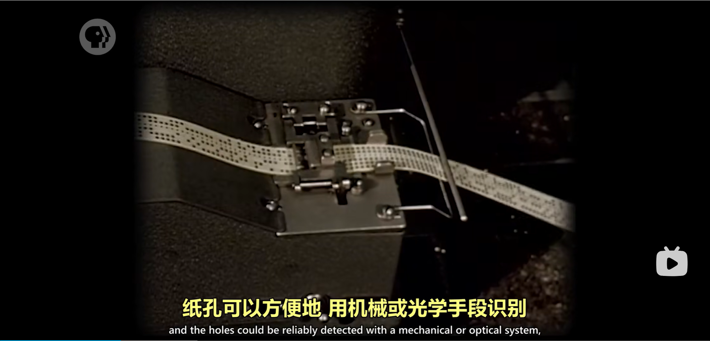
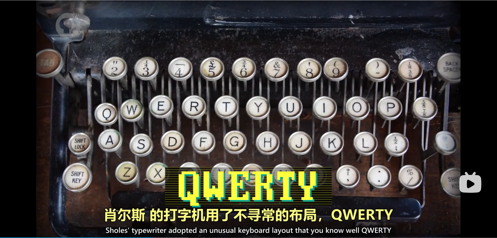
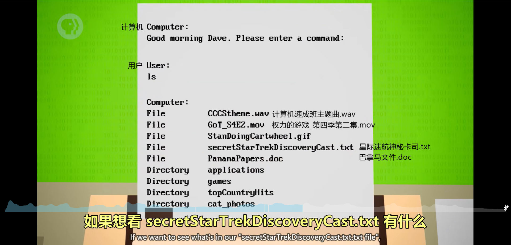
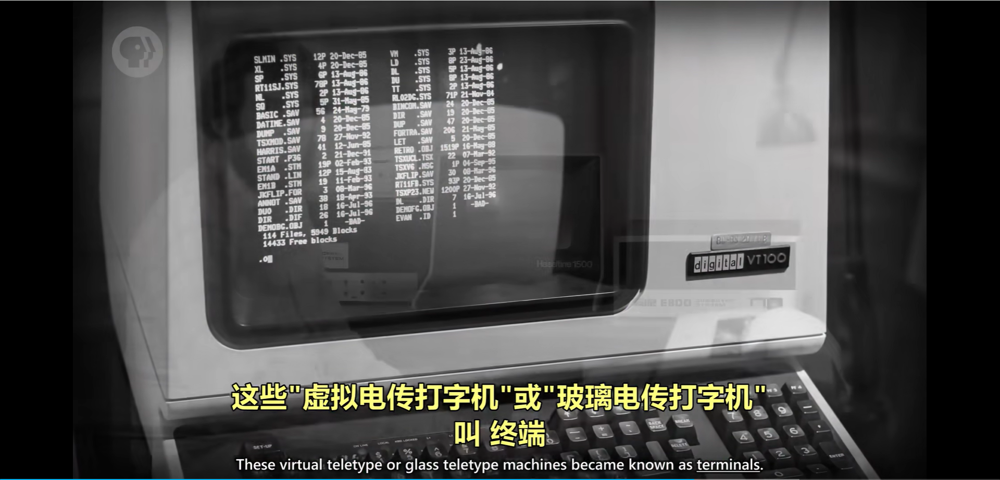

# 计算机科学速成课 Crash Course Computer Science

### 第二十二集 命令行界面 Keyboards & Command Line Interfaces

有很多种 input & output devices 让我们和计算机交互，它们在人类和计算机之间提供了界面，如今有整个学科专门研究这个——**人机交互（Human-Computer Interaction）**。

#### 前提

早期人类一直迁就机器，而把苦力活都交给人类自己去完成。到了1950年代晚期开始发生变化，一方面，小型计算机变得足够便宜，让人类频繁和计算机交互变得可以接受，另一方面，大型计算机变得更快，能同时支持多个程序和多个用户，这叫“多任务”（multitasking）和“分时系统”（time-sharing systems）。

#### 键盘

在交互式操作时，计算机需要以某种方式来获得用户输入，所以借用了当时已经存在的数据录入机制：键盘（keyboards）。现代打字机是克里斯托弗·莱瑟姆·肖尔斯在1868年发明的，用了不寻常的布局：**QWERTY**，这个名字来源于键盘左上角的按键**。这样设计最流行的理论是为了把常见字母放得远一些，避免按键卡住**，但是这个解释不全面。过去一个世纪有不少新的键盘布局被发明，宣称各种好处，但是人们已经熟悉了QWERTY的布局，**这是经济学家所说的转换成本**。QWERTY不是通用的，有很多的变体，如**法国的AZERTY布局**等。

手写速度大约每分钟 20个 ，打字机主要为了易读性和标准化，而不是速度

打字的潜力

1. 十字打字，速度更快
2. 盲打，打字时不用看键盘

#### 电传打字机

早期计**算机用了一种特殊打字机，是专门用来发电报的，称为电传打字机（teletype machine）**。按一个字母，信号会通过电报线发到另一端，另一端的电传打字机会打出来。因为电传打字机有电子接口，所以可以稍作修改用于计算机，电传交互界面在1960~1970年代很常见。

#### 命令行界面

**输入一个命令，然后按回车，计算机会输回来，用户和计算机来回“对话”**，这称为“命令行界面”（command line interfaces）。它是最主要的人机交互方式，一直到1980年代。用电传打字机的命令行交互类似这样：用户可以输入各种命令，输入命令 ls，名字来自 list 的缩写，然后计算机会列出当前目录里的所有文件，Unix用 cat 命令显示文件内容，cat 是 concatenate（连接） 的缩写，然后指定文件名，指定的方法是写在 cat 命令后面，传给命令的值叫参数。

#### 屏幕

屏幕最早出现在1950年代，但是日常使用太贵并且分辨率低，然而**因为针对普通消费者的电视机开始量产，同时处理器与内存也在发展**，到了1970年代，屏幕代替电传打字机变得可行。屏幕就像无限长的纸，除了输入和输出字没有其他东西，**协议是一样的，直接用现有的电传打字机协议**，所以计算机分不出是纸还是屏幕，这些“虚拟电传打字机”或“玻璃电传打字机”称为“终端”（terminals）。屏幕又好又快又灵活，如果删一个错别字会立刻消失，所以到了1970年代末屏幕成了标配。

#### 发展

早期著名交互式文字游戏 Zork 出现于 1977 年，游戏后来从纯文字进化为多人游戏，简称 MUD 或多人地牢游戏，是如今 MMORPG （大型多人在线角色扮演游戏）的前辈。

编程大部分依然是打字活，所以用命令行比较自然，因此即使是现在大多数程序员工作中依然用命令行界面，而且用命令行访问远程计算机是最常见的方式，比如服务器在另一个国家。

