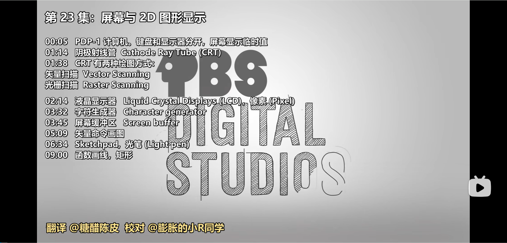
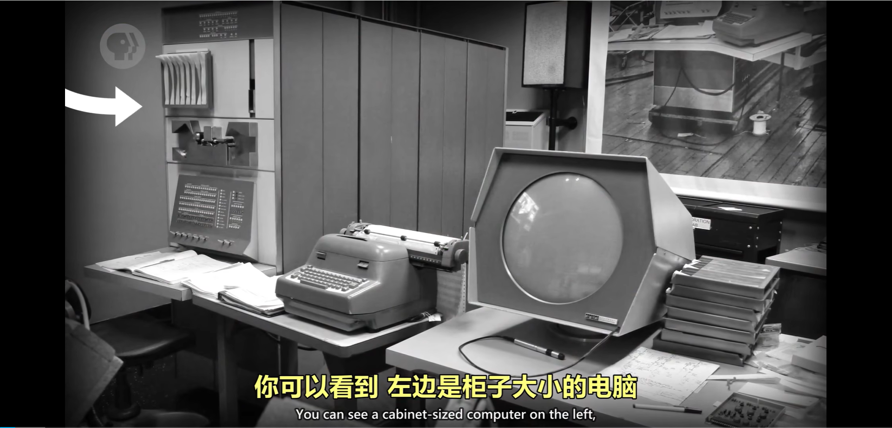
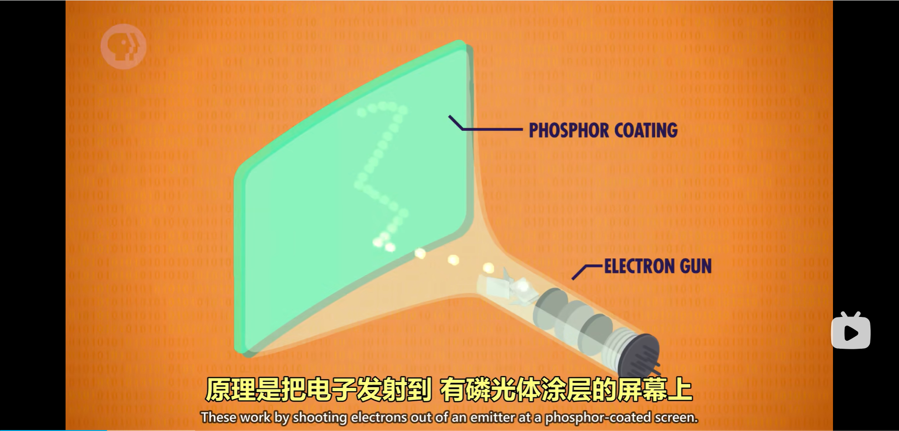
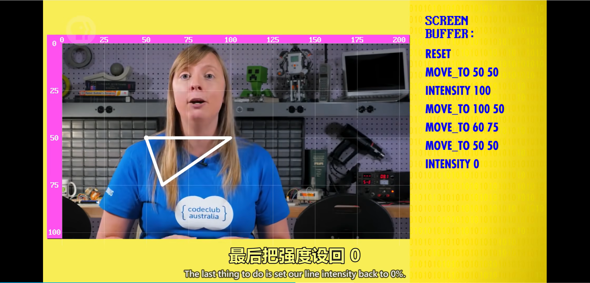
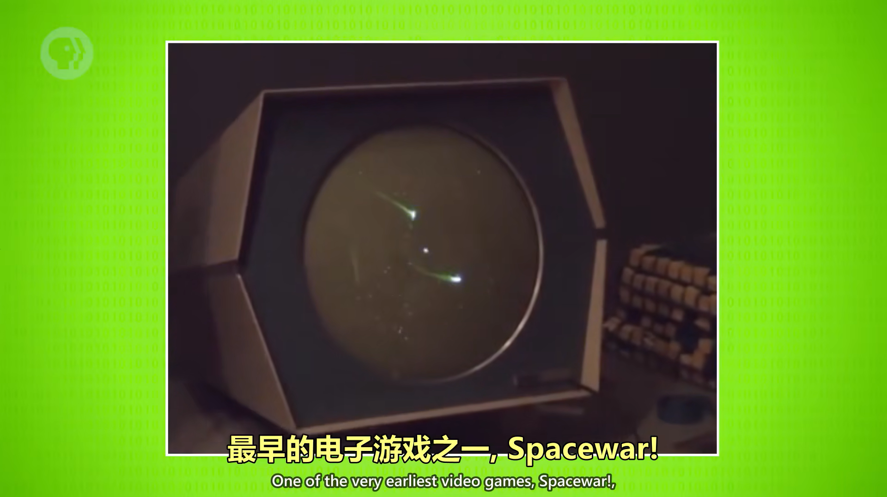
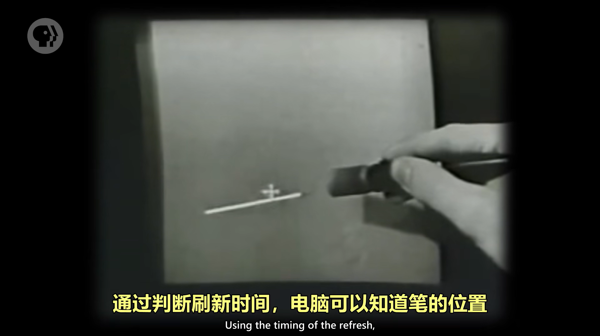
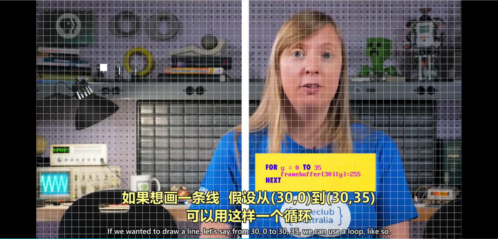

# 计算机科学速成课 Crash Course Computer Science

## 第二十三集 屏幕与2D图形显示（Screens & 2D Graphics）

---

### **核心目标：理解从文本显示到图形界面的演进历程**

- **问题起点**：早期计算机仅能显示文本，无法呈现图形信息
- **关键突破**：**矢量图形**技术使计算机能显示任意形状
- **核心理念**：**图形界面**改变了人机交互方式，使计算机从"数字计算器"变为"创意工具"

> 💡 **Carrie Anne 的洞见**：  
> *"图形显示不是计算机的'装饰'，  
> 而是解锁了计算潜能的'钥匙'——  
> 它让计算机从'数字处理器'  
> 变成了'创意伙伴'！"*

---

### **早期限制：纯文本显示**

- 1960年PDP-1是早期图形计算机的典型代表

- **问题**： 文本任务和图形任务是分开的 ，早期屏幕无法显示清晰的文字
- **局限**：
  - 无法表示文字（
- **现实影响**：计算机被视为**纯计算工具**，而非创意平台
- **屏幕用途**：主要用于显示程序临时值（如寄存器状态），而非最终输出结果
- **打印优势**：打印纸张提供更高对比度和分辨率，计算结果通常打印到纸张上

---

### **CRT显示器基础：阴极射线管**

- **工作原理**：
  - 电子束撞击磷光涂层屏幕产生发光，持续几分之一秒
  - 由于电子是带电粒子，路径可用电磁场控制
  - 屏幕内部用板子或线圈引导电子束到特定位置
  - 通过控制电子束强度形成图像

- **两种绘图模式**：
  - **矢量扫描**：电子束沿特定路径绘制线条，重复扫描形成稳定图像
  - **光栅扫描**：按固定路径逐行扫描，仅在特定点发光形成像素化图像

---

### **显示技术演进与内存限制**

LCD（液晶显示器）linquid crystal displays
原理：通过控制红绿蓝像素亮度实现色彩显示，每秒更新多次。 像素 pixels
关键突破：像素技术成熟后，取代CRT成为主流。**也用光栅扫描**

- **内存挑战**：
  - 200×200像素图像需40,000 bit内存（占PDP-1内存一半以上）
  - 早期计算机无法存储大量像素，需创新解决方案
- **字符网格方案**：
  - 早期计算机存储字符网格（如80×25字符）而非像素
  - 80×25字符网格仅需16,000 bit内存，更合理且节省资源
- **字符生成器**：
  - 内置ROM存储字符点阵图案（如ASCII字符）
  - 将字符代码转换为光栅图形显示到屏幕，需要额外的硬件 从内存读取字符，转换成光栅图形
  - 基本算是第一代显卡
- **屏幕缓冲区**：
  - **内存中预留区域**存储待显示数据
  - 程序通过修改缓冲区值实现动态更新
  
    缺陷 无法绘制 电路图、建筑平面图、地图等

---

### **矢量图形与交互设计**

矢量模型 vector mode

- **矢量命令画图**：
  - 所有内容由线段组成，无文字概念,如果要显示文字，就用线条画出来
  - 通过`MOVE_TO`、`INTENSITY`等指令绘制图形 
  - **矢量指令存储在内存中，通过矢量图形卡渲染**
  - 示例：绘制三角形仅需约160 bit内存
- Vectrex 一个早期的矢量显示系统
  - 
  
- **Spacewar!**（1962年）：
  - 最早电子游戏之一，基于PDP-1矢量图形
  
- 启发后续游戏如《爆破彗星》和《太空大战》
  
    
  
- **Sketchpad**（1962年）：
  - 首个完整图形应用，获图灵奖
  - 使用光笔（Light Pen）输入：通过检测屏幕刷新信号定位
  - 支持几何约束（平行/垂直线）、图形库调用、动态缩放
  - 实现复杂设计保存与共享，奠定CAD软件基础
  - 代表了，人机交互方式的关键转折点
  - 

---

### **位图显示与现代图形**

- **位图显示（Bitmapped Displays）**：
  - **内存中的位直接映射到屏幕像素**
  - **早期使用RAM，后发展为专用VRAM（显卡高速内存）**
  - 8位灰度屏幕：0强度（黑色）到255强度（白色）的像素值
  图形是一个巨大的像素值矩阵，计算机把像素数据存在内存中一个特殊区域， 帧缓冲区
    
- **编程实现**：
  - 程序可以操纵“帧缓冲区”中的像素数据，实现交互式图形
  - 通过循环控制像素值绘制直线、矩形
  - 封装图形函数（如`draw_rectangle()`）简化开发
- 图形库抽象底层操作，支持绘制曲线、文字，直线，图形等复杂元素
- **现代显示器**：
  - LCD仍使用光栅扫描技术
  - 每秒更新多次红绿蓝像素亮度

---

### **历史意义与影响**

- **1971年数据**：美国仅约1,000台交互式图形计算机
- **革命性转变**：
  - Sketchpad和Spacewar!推动人机交互革命
  - 计算机从"封闭的数学机器"转变为"交互式助手"
  - 为图形用户界面（GUI）普及奠定基础
- **技术普及**：
  - 位图显示技术成本高昂，持续数十年才普及
  - 从字符到像素，从矢量到光栅，屏幕技术的演进反映了计算能力与人类交互需求的共同进步