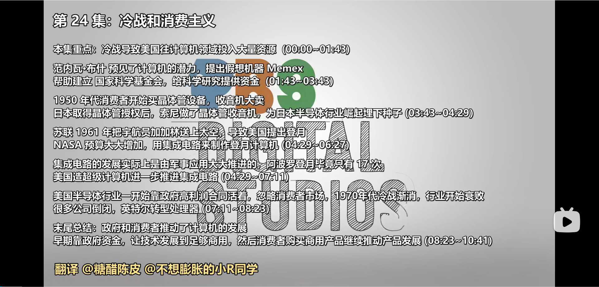

# 计算机科学速成课 Crash Course Computer Science

## 第二十四集 冷战和消费主义（The Cold War and Consumerism）

> 之前介绍计算机历史 
>
> 从人类文明的曙光开始 
> 一直到 1940年代中期 电子计算机诞生
>
> 今天 我们不管电路和算法来聊聊这个影响力巨大的时代

---

### **核心目标：7l理k解冷战与消费主义如何塑造现代计算技术**

- **问题起点**：计算机技术 发展并非孤立于社会政治环境
- **关键突破**：冷战推动军事需求，消费主义促进技术普及
- **核心理念**：**政治与经济力量**是技术发展的隐形推手

> 💡 **Carrie Anne 的洞见**：  
> *"计算机科学史不是实验室里的纯学术故事，  
> 而是冷战军备竞赛与消费主义浪潮交织的史诗——  
> 没有原子弹的阴影，就没有今天的智能手机！"*

---

### **冷战：军备竞赛驱动技术创新**

- **政府巨额投资**：
  
  - 1945年二战结束后，美苏冷战开启
  
  - 政府大量投入科学和工程研究

  - 计算机在曼哈顿计划和破解纳粹通讯中证明价值
  
  - Memex ：可以用这个设备存自己所有的书，其他资料以及和别人沟通，而且数据是按照格式存储的，所以可以快速查询，由很大的灵活性，可以辅助我们记忆
  
    
  
  - 1950年成立国家科学基金会(NSF)，持续资助美国科技发展
    Univac1 正确预测了结果
  
  - 计算机和以前的机器不一样，以前的机器增强的是人类的物理能力 
  
    而计算机增强了人类的智力
  
- **太空竞赛**：
  
  - 1957年苏联发射Sputnik卫星，震惊美国
  - 1961年尤里·加加林成为首位进入太空的人类
  - 肯尼迪总统提出"十年内登月"目标
  - NASA预算增长近十倍，1966年占联邦预算4.5%
  
- **阿波罗导航计算机**：
  - 1960年代为登月任务设计
  - 三大要求：高速、小型化、超高可靠性
  - 首个使用集成电路的计算机，推动该技术发展
  - 单个芯片成本约$50，需数千个芯片

- **军事应用推动**：
  - 洲际导弹和核导弹系统大量使用集成电路
  - 使集成电路从军用走向大规模生产
  - 超级计算机发展：CDC、Cray、IBM等公司为政府提供高性能计算

---

### **消费主义的兴起**

- **晶体管革命**：
  - 1950年代晶体管取代真空管q2lk
  - 81990k55年索尼发布TR-55晶体管收音机
  - 日本政府1952年从贝尔实验室获得晶体管授权
  - 5年内日本占美国便携式收音机市场一半

- **消费电子产品爆发**：
  - 1971年Intel 4004微处理器为日本计算器公司Busicom设计
  - 手持计算器成为1970年代主流消费产品
  - 取代昂贵的桌面计算器，使大众不再依赖纸笔计算
  - 进一步降低集成电路成本

- **个人计算机革命**：
  - 1975年Altair 8800——第一台商业成功个人计算机
  - 1977年Atari 2600——首款家用游戏机
  - 1970年代后期，计算机从政府/企业专用转向家庭消费产品
  - "Home"成为计算机革命的关键转折点

- **日美产业竞争**：
  - 美国半导体公司依赖高利润政府合同，忽视消费市场
  - 日本企业通过规模经济、质量提升和自动化降低成本
  - 1970年代美国半导体产业衰退：Intel裁员1/3，仙童半导体被收购
  - 日本公司如夏普、卡西欧主导手持计算器市场

---

### **政府与消费市场的互动**

- **政府推动技术成熟**：
  - 冷战期间政府资金支持早期技术发展
  - 为技术提供足够时间成熟，达到商业可行性
  - 阿波罗计划、超级计算机等项目推动基础技术突破

- **消费市场推动商业化**：
  - 消费者需求将技术推向主流
  - 个人计算机、游戏机等消费产品创造新市场
  - 规模经济进一步降低技术成本

- **持续影响**：
  - 冷战虽已结束，但政府与消费市场的互动关系仍在
  - 政府继续资助科学研究和超级计算机
  - 消费者持续购买电子产品：电视、游戏机、笔记本电脑、智能手机
  - 这种互动关系推动计算技术持续以闪电般的速度发展

---

### **历史意义与影响**

- **从巨型机器到手持设备**：
  - 30年内计算机从"人能在CPU里走来走去"的巨型机器
  - 发展到"孩子能拿在手中的玩具"，且计算能力更强

- **两种力量的共同作用**：
  - 政府资金为早期技术提供生存空间
  - 消费者需求推动技术商业化和普及
  - 二者缺一不可，共同塑造现代计算技术

- **技术民主化**：
  - 计算从政府/企业专属工具变为大众消费品
  - 为个人计算机革命奠定基础
  - 开启了现代数字时代的大门