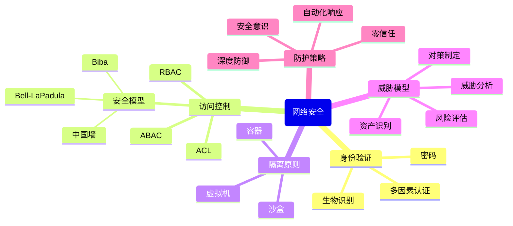

# 计算机科学速成课 Crash Course Computer Science

## 第三十一集 计算机安全（Cybersecurity）

---

### **核心目标：理解网络安全的基本原则与防护机制**
- **问题起点**：计算机无道德判断，执行恶意代码与执行有用代码无区别
- **关键突破**：通过**身份验证**与**访问控制**建立数字世界的"法律与秩序"
- **核心理念**：**安全是过程而非终点**，需持续适应新威胁

> 💡 **Carrie Anne 的洞见**：  
> *"网络安全不是'坚不可摧的城堡'，  
> 而是'持续演化的生态系统'——  
> 正如现实世界需要法律、警察和保险，  
> 数字世界也需要多层次的安全防护！"*

---

### **网络安全基础：为何我们需要安全**
#### 1. **计算机的无差别性**
   - **核心问题**：计算机没有道德判断能力
     - 执行"破坏医院系统"的代码 ↔ 执行"维持病人心跳"的代码
     - 对计算机而言没有区别
   - **现实影响**：
     - 恶意代码可造成真实世界伤害
     - 安全漏洞可能危及生命（医疗系统、交通控制等）
   - **类比**：
     > *"就像'原力'一样，计算机可以被拉到'光明面'或'黑暗面'——  
     > 技术本身无善恶，关键在于使用者的意图！"*

#### 2. **安全三要素（CIA Triad）**
| 要素                            | 定义                       | 重要性             | 破坏后果           |
| ------------------------------- | -------------------------- | ------------------ | ------------------ |
| **保密性**<br>(Confidentiality) | 确保信息仅被授权方访问     | 保护隐私、商业机密 | 信息泄露、身份盗窃 |
| **完整性**<br>(Integrity)       | 确保信息不被未授权修改     | 维护数据准确可靠   | 数据篡改、信任丧失 |
| **可用性**<br>(Availability)    | 确保授权用户能访问所需资源 | 保障服务持续运行   | 服务中断、业务损失 |

#### 3. **安全的经济视角**
   - **成本平衡**：
     - 完美安全 = 零风险 = 零可用性（不联网的计算机）
     - 理想安全 = 风险与成本的平衡点
   - **安全投资回报**：
     - 预防成本 < 恢复成本（平均1:4比例）
     - 2022年全球网络犯罪损失：$6万亿美元

> ✅ **关键认知**：安全不是"有无"问题，而是"程度"和"成本"问题

---

### **身份验证与访问控制**
#### 1. **身份验证（Authentication）**
   - **定义**：确认"你是谁"的过程
   - **验证因素**：
     | 类型           | 示例           | 安全性 | 缺陷             |
     | -------------- | -------------- | ------ | ---------------- |
     | **你知道什么** | 密码、PIN码    | 低     | 可猜测、钓鱼     |
     | **你有什么**   | 手机、安全令牌 | 中     | 可丢失、窃取     |
     | **你是什么**   | 指纹、面部识别 | 高     | 可伪造、技术限制 |
   - **多因素认证（MFA）**：
     - 结合2+种验证因素
     - 降低99.9%账户被入侵风险
     - 2023年85%企业已实施MFA

#### 2. **访问控制（Access Control）**
   - **核心原则**：最小权限原则（Least Privilege）
     - 用户/程序仅获得完成任务所需的最小权限
   - **权限类型**：
     | 权限                | 作用         | 风险         |
     | ------------------- | ------------ | ------------ |
     | **读（Read）**      | 查看文件内容 | 信息泄露     |
     | **写（Write）**     | 修改内容     | 数据篡改     |
     | **执行（Execute）** | 运行程序     | 恶意代码执行 |
   - **实现方式**：
     - **访问控制列表（ACL）**：定义用户对每个资源的权限
     - **角色基础访问控制（RBAC）**：按角色分配权限
     - **属性基础访问控制（ABAC）**：基于属性动态决策

> 💡 **Carrie Anne 的强调**：  
> *"权限应该给合适的人，拒绝错误的人——  
> 银行员工可以打开ATM补充现金，  
> 但我不应该有权限，因为我可能会拿走所有钱！  
> 陶瓷猫收藏品可不会从天上掉下来哟！"*

---

### **安全模型与策略**
#### 1. **Bell-LaPadula 模型**
   - **核心原则**：**"不能向上读，不能向下写"**
     - 低安全级别用户不能读取高安全级别数据
     - 高安全级别用户不能写入低安全级别数据
   - **应用场景**：美国国防部多层安全政策
   - **优势**：防止敏感信息泄露
   - **局限**：不保护数据完整性

#### 2. **Biba 模型**
   - **核心原则**：**"不能向上写，不能向下读"**
     - 保护数据完整性而非保密性
     - 高完整性数据不能被低完整性数据污染
   - **应用场景**：金融系统、医疗记录

#### 3. **中国墙模型（Chinese Wall）**
   - **核心原则**：**利益冲突隔离**
     - 用户不能访问可能产生利益冲突的数据
   - **应用场景**：咨询公司、法律事务所
   - **例子**：咨询师不能同时为竞争公司提供服务

#### 4. **安全模型选择指南**
| 需求             | 推荐模型      | 原因               |
| ---------------- | ------------- | ------------------ |
| **政府机密保护** | Bell-LaPadula | 防止信息泄露       |
| **金融数据保护** | Biba          | 保证数据完整性     |
| **咨询行业**     | 中国墙        | 避免利益冲突       |
| **综合需求**     | 混合模型      | 平衡保密性与完整性 |

> ✅ **关键启示**：没有"最佳"安全模型，只有"最适合"特定场景的模型

---

### **隔离原则与沙盒技术**
#### 1. **隔离（Isolation）的核心思想**
   - **定义**：限制程序/用户对系统其他部分的影响
   - **类比**：将生气的小孩放在沙箱里
     - 他们只能摧毁自己的沙堡
     - 不会影响其他孩子继续玩耍
   - **技术实现**：
     - **内存隔离**：操作系统为每个程序分配独立内存块
     - **进程隔离**：限制进程间通信
     - **权限隔离**：限制程序可执行的操作

#### 2. **沙盒（Sandboxing）技术**
   - **工作原理**：
     ```mermaid
     graph LR
     A[应用程序] --> B[沙盒环境]
     B --> C[受限资源访问]
     C --> D[安全边界]
     D --> E[操作系统核心]
     E --> F[物理硬件]
     ```
   - **应用场景**：
     - 浏览器标签页隔离
     - 移动应用权限控制
     - 恶意软件分析环境
   - **优势**：
     - ✅ 限制漏洞影响范围
     - ✅ 防止恶意软件横向移动
     - ✅ 便于监控可疑行为

#### 3. **虚拟机与容器安全**
| 技术         | 隔离级别           | 性能开销 | 适用场景     |
| ------------ | ------------------ | -------- | ------------ |
| **虚拟机**   | 高（完整操作系统） | 高       | 严格隔离需求 |
| **容器**     | 中（进程级隔离）   | 低       | 微服务架构   |
| **无服务器** | 高（短暂执行环境） | 低       | 事件驱动应用 |

   - **安全优势**：
     - 单个虚拟机崩溃不影响其他虚拟机
     - 恶意代码被限制在容器内
     - 无服务器函数执行完即销毁，不留痕迹

> 💡 **Carrie Anne 的解释**：  
> *"隔离是计算机安全的'免疫系统'——  
> 当病毒入侵时，它限制感染范围，  
> 让系统其他部分继续正常工作！"*

---

### **威胁模型分析**
#### 1. **威胁模型定义**
   - **核心思想**：针对特定威胁情境进行安全规划
   - **与传统方法的区别**：
     - 传统：试图防御所有可能攻击 → 不切实际
     - 威胁模型：聚焦实际可能的攻击 → 高效实用
   - **关键问题**：**"攻击者能做什么？想得到什么？"**

#### 2. **威胁模型构建步骤**
   1. **确定资产**：识别需要保护的关键数据/系统
   2. **识别威胁**：谁可能攻击？为什么？
   3. **分析漏洞**：系统中的弱点是什么？
   4. **评估风险**：可能性 × 影响程度
   5. **制定对策**：针对高风险威胁的防护措施

#### 3. **实际案例分析**
   - **场景**：保护笔记本电脑的物理安全
   - **威胁模型**："好管闲事的室友"
   - **安全措施**：
     - 藏在脏兮兮的洗衣篮里（保密性）
     - 设置强密码（身份验证）
     - 加密敏感文件（数据保护）
   - **假设**：室友不会破坏电脑，只想窥探

#### 4. **威胁模型示例**
| 威胁         | 可能性 | 影响 | 缓解措施           |
| ------------ | ------ | ---- | ------------------ |
| **物理盗窃** | 高     | 极高 | 全盘加密、远程擦除 |
| **恶意软件** | 高     | 高   | 防病毒、定期更新   |
| **网络钓鱼** | 中     | 高   | 安全培训、MFA      |
| **零日漏洞** | 低     | 极高 | 深度防御、快速补丁 |

> ✅ **关键原则**：安全解决方案必须基于**可验证的假设**（如"没人会泄露密码"）

---

### **攻击向量与防护策略**
#### 1. **常见攻击向量**
| 类型           | 描述             | 防护措施             |
| -------------- | ---------------- | -------------------- |
| **网络攻击**   | 通过网络漏洞入侵 | 防火墙、入侵检测系统 |
| **社会工程**   | 欺骗用户泄露信息 | 安全培训、验证流程   |
| **物理攻击**   | 直接接触设备     | 生物识别、安全锁     |
| **供应链攻击** | 污染软件供应链   | 代码审计、签名验证   |

#### 2. **社会工程学攻击**
   - **钓鱼（Phishing）**：伪装成可信来源获取信息
     - 防护：检查URL、不点击可疑链接
   - **尾随（Tailgating）**：跟随授权人员进入限制区域
     - 防护：物理访问控制、安全意识
   - **预文本（Pretexting）**：编造借口获取信息
     - 防护：验证身份、多渠道确认

#### 3. **深度防御策略（Defense in Depth）**
   - **核心思想**：多层防护，单点失效不影响整体安全
   - **七层防护模型**：
     1. 物理安全（门禁、生物识别）
     2. 网络安全（防火墙、IDS）
     3. 主机安全（补丁、配置）
     4. 应用安全（代码审计、WAF）
     5. 数据安全（加密、备份）
     6. 身份管理（MFA、RBAC）
     7. 安全意识（培训、演练）

> 💡 **Carrie Anne 的提醒**：  
> *"没有'银弹'解决方案——  
> 安全需要技术、流程和人员的协同，  
> 就像现实世界需要法律、警察和公民意识！"*

---

### **网络安全的未来挑战**
#### 1. **新兴技术风险**
   - **物联网（IoT）**：
     - 2023年：300亿台联网设备
     - 风险：弱密码、缺乏更新机制
     - 案例：Mirai僵尸网络攻击
   - **人工智能**：
     - 风险：对抗性攻击、数据投毒
     - 案例：欺骗面部识别系统
   - **量子计算**：
     - 风险：破解当前加密算法
     - 应对：后量子密码学

#### 2. **安全发展趋势**
| 趋势             | 描述                 | 影响             |
| ---------------- | -------------------- | ---------------- |
| **零信任架构**   | "永不信任，始终验证" | 消除网络边界依赖 |
| **自动化响应**   | AI驱动的安全运营     | 缩短响应时间     |
| **隐私增强技术** | 保护数据同时允许分析 | 满足GDPR等法规   |
| **安全左移**     | 开发早期集成安全     | 降低修复成本     |

#### 3. **个人安全最佳实践**
   - **密码管理**：
     - 使用密码管理器
     - 每个账户唯一密码
     - 启用MFA
   - **软件更新**：
     - 及时更新操作系统和应用程序
     - 自动更新重要安全补丁
   - **数据备份**：
     - 3-2-1规则：3份备份，2种介质，1份离线
     - 定期测试恢复过程
   - **安全意识**：
     - 警惕钓鱼邮件
     - 验证可疑请求
     - 保护个人信息

> ✅ **关键数据**：启用MFA可阻止99.9%的账户入侵，但全球仅16%用户使用

---

### **思考与延伸**
#### 1. **安全与隐私的平衡**
   - **监控 vs 隐私**：安全措施可能侵犯用户隐私
   - **透明度挑战**：用户往往不知数据如何被保护
   - **伦理框架**：需要建立安全伦理准则
   - **解决方案**：
     - 隐私设计（Privacy by Design）
     - 最小数据收集原则
     - 透明的隐私政策

#### 2. **国家安全视角**
   - **网络战**：国家支持的黑客攻击
   - **关键基础设施**：电网、水处理系统脆弱性
   - **国际规范**：需要全球网络安全协议
   - **双重用途技术**：防御技术也可用于攻击

#### 3. **安全经济模型**
   - **外部性问题**：单个组织的安全投资影响整个生态系统
   - **保险市场**：网络安全保险的兴起
   - **责任分配**：软件漏洞责任归属
   - **激励机制**：如何鼓励安全投资

#### 4. **未来安全范式**
   - **自修复系统**：自动检测和修复漏洞
   - **区块链安全**：去中心化信任机制
   - **生物启发安全**：模拟免疫系统
   - **量子安全密码学**：抵御量子计算威胁

---

### **安全思维导图**


> ✅ **Carrie Anne 的总结**：  
> *"网络安全不是终点，而是一段旅程——  
> 没有绝对安全，只有持续改进。  
> 但只要我们坚持'最小权限'原则，  
> 构建'深度防御'体系，  
> 培养'安全第一'的文化，  
> 我们就能在数字世界中既安全又自由地生活！  
> 记住：你是数字世界的守护者，  
> 也是它的受益者！"*

---

**下集预告**：深入探讨 **"密码学"** ——揭秘加密技术如何保护我们的在线通信，从凯撒密码到现代公钥加密，以及量子计算将如何改变加密格局！