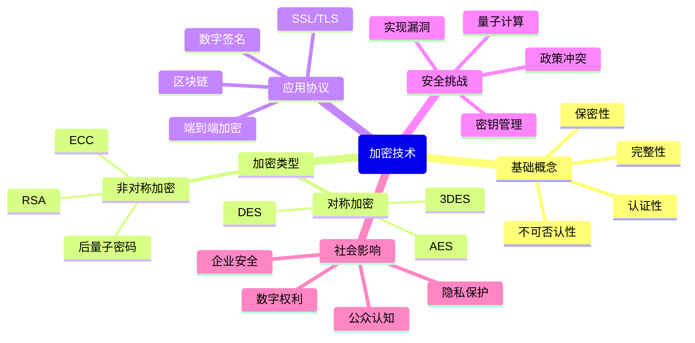

# 计算机科学速成课 Crash Course Computer Science

## 第三十三集 加密（Cryptography）

---

### **核心目标：理解加密技术如何保护数字世界的安全通信**
- **问题起点**：网络通信本质上不安全，需要加密技术保护隐私和完整性
- **关键突破**：**公钥加密**解决了密钥分发问题，使安全通信成为可能
- **核心理念**：**加密不是魔法**，而是基于数学原理的安全保障机制

> 💡 **Carrie Anne 的洞见**：  
> *"加密技术是数字世界的'锁和钥匙'——  
> 没有它，互联网将只是一个公开的广场，  
> 而不是安全的交易场所和私人空间！"*

---

### **加密基础：从简单到复杂**
#### 1. **加密定义与目的**
   - **定义**：将明文转换为密文的过程，使未授权方无法理解
   - **核心目的**：
     - **保密性**：保护信息不被未授权方读取
     - **完整性**：确保信息未被篡改
     - **认证性**：验证信息来源
     - **不可否认性**：发送方无法否认发送过信息

#### 2. **凯撒密码：最简单的替换加密**
   - **工作原理**：字母表偏移固定位置
     - 例：偏移3 → A→D, B→E, C→F...
   - **弱点**：
     - 仅26种可能密钥
     - 频率分析可轻松破解
   - **历史意义**：最早系统化加密方法之一

#### 3. **替换密码与频率分析**
   - **原理**：每个字母随机映射到另一个字母
   - **优势**：26!种可能密钥（约4×10²⁶）
   - **破解方法**：
     - 利用语言统计特性（英语中E最常见）
     - 词频分析（THE, AND等高频词）
   - **历史影响**：阿拉伯学者首次提出频率分析（9世纪）

#### 4. **多表替换：维吉尼亚密码**
   - **创新**：使用多个替换表，基于密钥轮换
   - **工作原理**：
     ```
     明文:  A T T A C K
     密钥:  S E C R E T
     密文:  S X V R G J
     ```
   - **优势**：抵抗简单频率分析
   - **破解**：卡西斯基试验（寻找重复模式）

> ✅ **关键启示**：加密安全性不在于算法保密，而在于密钥保密（柯克霍夫原则）

---

### **对称加密 vs 非对称加密**
#### 1. **对称加密（共享密钥）**
   - **工作原理**：加密和解密使用相同密钥
   - **常见算法**：
     - **DES**（数据加密标准）：56位密钥（已过时）
     - **3DES**：三重DES，增强安全性
     - **AES**（高级加密标准）：128/192/256位密钥（现代标准）
   - **优势**：
     - ✅ 加密/解密速度快
     - ✅ 适合大量数据加密
   - **局限**：
     - ❌ 密钥分发问题：如何安全共享密钥
     - ❌ 密钥管理复杂：n用户需要n(n-1)/2个密钥

#### 2. **非对称加密（公钥加密）**
   - **工作原理**：使用一对数学相关的密钥
     - **公钥**：可公开分享，用于加密
     - **私钥**：严格保密，用于解密
   - **核心突破**：解决密钥分发问题
   - **类比**：
     > *"就像一个特殊的箱子：  
     > 任何人都可以用锁（公钥）锁上它，  
     > 但只有持有钥匙（私钥）的人才能打开！"*

#### 3. **公钥加密工作原理**
   ```mermaid
   sequenceDiagram
     Alice->>Bob: 发送公钥
     Bob->>Alice: 用公钥加密消息
     Alice->>Bob: 用私钥解密消息
     Bob->>Alice: 发送加密响应
   ```

   - **关键特性**：
     - 公钥加密 → 私钥解密（保密通信）
     - 私钥加密 → 公钥解密（数字签名）
   - **数学基础**：
     - 大数质因数分解（RSA）
     - 椭圆曲线离散对数（ECC）
     - 难以计算的单向函数

> 💡 **Carrie Anne 的解释**：  
> *"为了收到安全的信息，我们可以给别人箱子和锁，  
> 别人把信息放箱子，然后锁起来，  
> 把盒子寄回给我，只有我的私钥能打开——  
> 上锁后，除了暴力尝试没有其他办法！"*  

---

### **公钥加密的数学基础**
#### 1. **RSA算法（1977年）**
   - **发明者**：Rivest, Shamir, Adleman
   - **数学原理**：
     1. 选择两个大素数p和q
     2. 计算n = p × q
     3. 计算φ(n) = (p-1)(q-1)
     4. 选择公钥e，满足1 < e < φ(n)且互质
     5. 计算私钥d，满足e × d ≡ 1 (mod φ(n))
   - **加密**：c = m^e mod n
   - **解密**：m = c^d mod n
   - **安全性**：基于大数质因数分解的困难性

#### 2. **椭圆曲线加密（ECC）**
   - **原理**：基于椭圆曲线上的离散对数问题
   - **优势**：
     - 相同安全级别下，密钥更短
     - 计算更快，资源消耗更少
     - 适合移动设备和物联网
   - **应用**：
     - 比特币/区块链
     - 移动设备安全
     - TLS 1.3协议

#### 3. **单向函数与陷门函数**
   - **单向函数**：易于计算但难以逆向
     - 例：乘法（易） vs 质因数分解（难）
   - **陷门函数**：有"陷门"（私钥）时可逆向
     - 例：RSA中，知道p和q可轻松计算φ(n)
   - **关键特性**：
     - 给定x，计算f(x)容易
     - 给定f(x)，计算x困难
     - 但有陷门信息时，计算x变得容易

> ✅ **关键数据**：2048位RSA密钥 ≈ 112位对称加密强度，而256位ECC ≈ 128位对称加密强度

---

### **数字签名与身份验证**
#### 1. **数字签名原理**
   - **工作方式**：用私钥"加密"消息摘要
   - **验证过程**：用公钥"解密"并比对摘要
   - **特性**：
     - **认证性**：确认发送方身份
     - **完整性**：检测消息是否被篡改
     - **不可否认性**：发送方无法否认发送过

#### 2. **数字签名流程**
   ```mermaid
   sequenceDiagram
     Alice->>Alice: 1. 计算消息哈希
     Alice->>Alice: 2. 用私钥加密哈希
     Alice->>Bob: 3. 发送消息+签名
     Bob->>Bob: 4. 计算消息哈希
     Bob->>Bob: 5. 用公钥解密签名
     Bob->>Bob: 6. 比对两个哈希
   ```

#### 3. **证书与公钥基础设施（PKI）**
   - **问题**：如何信任公钥确实属于声称的所有者？
   - **解决方案**：数字证书 + 证书颁发机构（CA）
   - **工作流程**：
     1. 实体申请证书
     2. CA验证身份
     3. CA用私钥签署证书
     4. 用户信任CA的公钥验证证书
   - **应用**：
     - HTTPS网站安全（浏览器内置CA列表）
     - 代码签名（验证软件来源）
     - 电子邮件加密（S/MIME）

> 💡 **Carrie Anne 的强调**：  
> *"数字签名不只是'电子签名'——  
> 它是互联网信任的基石，  
> 让我们能在不信任网络的情况下，  
> 依然信任通信的内容！"*

---

### **加密协议与应用**
#### 1. **SSL/TLS协议：安全网络通信**
   - **作用**：保护HTTP通信（HTTPS）
   - **握手过程**：
     1. 客户端发送支持的加密套件
     2. 服务器选择套件并发送证书
     3. 客户端验证证书
     4. 交换会话密钥（使用非对称加密）
     5. 切换到对称加密进行高效通信
   - **现代版本**：TLS 1.2, TLS 1.3（2018年）

#### 2. **端到端加密（E2EE）**
   - **原理**：仅通信双方能读取消息
   - **实现方式**：
     - **双棘轮算法**（Signal协议）：每次消息更新密钥
     - **前向保密**：即使长期密钥泄露，历史消息仍安全
   - **应用**：
     - Signal, WhatsApp, Telegram
     - 企业安全通信
     - 区块链交易

#### 3. **零知识证明**
   - **概念**：证明者向验证者证明知道某信息，而不泄露信息本身
   - **经典例子**：阿里巴巴洞穴
   - **应用**：
     - 匿名认证
     - 区块链隐私保护（Zcash）
     - 安全多方计算

#### 4. **同态加密**
   - **概念**：对加密数据进行计算，结果解密后与明文计算结果相同
   - **类型**：
     - 部分同态：支持一种操作（加或乘）
     - 全同态：支持任意计算
   - **应用**：
     - 安全云计算
     - 隐私保护数据分析
     - 机密数据共享

> ✅ **关键数据**：95%的网站使用HTTPS，TLS 1.3采用率已达70%（2023年）

---

### **加密的现代挑战**
#### 1. **量子计算威胁**
   - **风险**：Shor算法可在多项式时间内破解RSA/ECC
     - 经典计算机：破解2048位RSA需数千年
     - 量子计算机：理论上几小时
   - **应对措施**：
     - **后量子密码学**：基于格、编码、多变量等难题
     - **NIST标准化**：CRYSTALS-Kyber（密钥封装），CRYSTALS-Dilithium（签名）
     - **混合方案**：传统+后量子算法并用

#### 2. **实现漏洞**
   - **常见问题**：
     - 错误的随机数生成
     - 侧信道攻击（计时、功耗分析）
     - 协议实现缺陷（Heartbleed漏洞）
   - **解决方案**：
     - 标准库替代自研加密
     - 定期安全审计
     - 形式化验证

#### 3. **政策与法律挑战**
   - **加密后门争议**：
     - 执法部门要求访问权
     - 安全专家反对（削弱整体安全）
   - **全球监管差异**：
     - 欧盟：强隐私保护（GDPR）
     - 中国：数据本地化要求
     - 美国：出口管制与执法需求

#### 4. **密钥管理挑战**
   - **问题**：
     - 私钥丢失 = 数据永久不可访问
     - 私钥泄露 = 安全完全失效
   - **解决方案**：
     - 硬件安全模块（HSM）
     - 分布式密钥管理
     - 阈值密码学

> 💡 **Carrie Anne 的提醒**：  
> *"量子计算机不是加密的末日，  
> 而是加密技术演进的催化剂——  
> 就像从DES到AES的过渡，  
> 我们正为后量子时代做准备！"*

---

### **加密的社会影响**
#### 1. **隐私保护与监控平衡**
   - **积极影响**：
     - 保护个人隐私
     - 防止大规模数据收集
     - 支持言论自由（尤其在专制国家）
   - **挑战**：
     - 执法部门难以获取证据
     - 可能被犯罪分子滥用
     - 公共安全与个人隐私的平衡

#### 2. **数字权利与主权**
   - **加密货币**：比特币基于加密技术
   - **去中心化身份**：用户控制自己的身份
   - **数据主权**：个人对数据的控制权
   - **数字人权**：加密作为基本权利

#### 3. **企业安全实践**
   - **数据加密**：
     - 静态数据（硬盘加密）
     - 传输中数据（TLS）
     - 使用中数据（内存加密）
   - **最佳实践**：
     - 默认加密
     - 最小权限原则
     - 定期密钥轮换
     - 完整审计日志

#### 4. **加密素养**
   - **公众认知**：
     - 误解：加密=犯罪工具
     - 现实：加密是日常技术（银行、购物）
   - **教育需求**：
     - 基础加密知识
     - 安全习惯培养
     - 识别钓鱼攻击

> ✅ **关键事实**：90%的组织表示加密是其安全战略的核心部分，但仅44%有全面加密策略

---

### **思考与延伸**
#### 1. **加密与道德责任**
   - **技术中立性**：加密技术本身无善恶
   - **开发者责任**：
     - 选择强加密算法
     - 避免后门
     - 透明安全实践
   - **用户责任**：
     - 使用强密码
     - 启用端到端加密
     - 定期更新软件

#### 2. **未来加密趋势**
   - **全同态加密**：实现真正的隐私计算
   - **量子安全网络**：抗量子加密基础设施
   - **生物加密**：基于生物特征的密钥生成
   - **AI驱动安全**：智能威胁检测与响应

#### 3. **加密教育与普及**
   - **密码学课程**：从基础到高级
   - **可视化工具**：帮助理解复杂概念
   - **游戏化学习**：加密挑战与竞赛
   - **开源项目**：实践学习机会

#### 4. **加密与可持续发展**
   - **能效优化**：
     - 轻量级加密算法
     - 降低加密计算开销
   - **硬件创新**：
     - 专用加密处理器
     - 低功耗设计
   - **生命周期管理**：
     - 安全密钥销毁
     - 加密设备回收

---

### **加密思维导图**


> ✅ **Carrie Anne 的总结**：  
> *"加密不是神秘的黑魔法，  
> 而是基于坚实数学原理的科学——  
> 从凯撒密码到量子安全算法，  
> 人类一直在寻找安全通信的方法。  
> 下次当你看到浏览器地址栏的锁图标，  
> 请记住背后是数百年密码学的智慧结晶，  
> 保护着你每一次点击的安全！  
> 加密不是为了隐藏什么，  
> 而是为了让我们能更自由地连接世界！"*

---

**下集预告**：深入探讨 **"压缩技术"** ——揭秘如何用更少的比特表示更多信息，从ZIP文件到流媒体视频，压缩如何改变我们的数字生活！