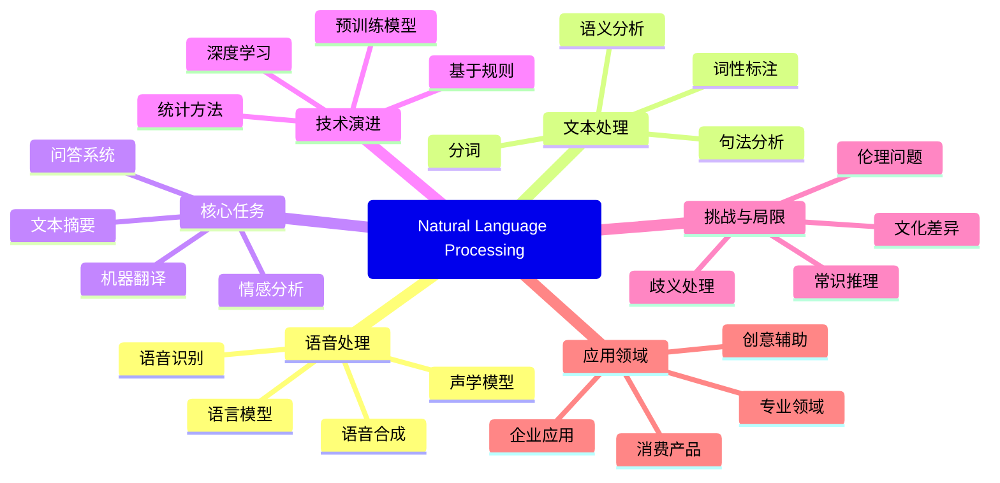

# 计算机科学速成课 Crash Course Computer Science

## 第三十六集 自然语言处理（Natural Language Processing）

---

### **核心目标：理解计算机如何理解和生成人类语言**
- **问题起点**：人类语言充满歧义、上下文依赖和文化背景，计算机难以理解
- **关键突破**：**统计模型**与**语法规则**的结合，让计算机能处理自然语言
- **核心理念**：**语言是结构化的**，可拆解为可计算的组件

> 💡 **Carrie Anne 的洞见**：  
> *"自然语言处理不是让计算机'理解'语言，  
> 而是找到语言中的**模式**和**结构**——  
> 就像拼图游戏，计算机不需要'感受'图片，  
> 只需找到匹配的拼片！"*

---

### **自然语言处理的核心任务**
#### 1. **语音识别（Speech Recognition）**
   - **工作原理**：将声音波形转换为文本
   - **关键组件**：
     - **声学模型**：将声音片段映射到可能的音素
     - **语言模型**：基于上下文预测最可能的单词序列
   - **示例**：
     - "she was" → 更可能接形容词("happy")而非名词("harpy")
     - 语言模型提供概率："happy"比"harpy"更可能

#### 2. **语言理解（Language Understanding）**
   - **核心挑战**：处理语言的歧义性
     - 多义词：`rose`（玫瑰/上升）、`leaves`（叶子/离开）
     - 词性歧义：同一词可作名词/动词
   - **解决方法**：
     - **数字词典**：基本词汇信息
     - **语法规则**：短语结构规则
     - **上下文分析**：根据前后文确定含义

#### 3. **语言生成（Language Generation）**
   - **工作原理**：将结构化数据转换为自然语言
   - **关键组件**：
     - **内容规划**：决定说什么
     - **句子规划**：决定如何表达
     - **表面实现**：生成最终文本
   - **应用**：
     - 虚拟助手回答问题
     - 自动生成新闻摘要
     - 机器翻译

#### 4. **对话系统（Dialogue Systems）**
   - **类型**：
     - **任务导向**：完成特定任务（如订票）
     - **闲聊型**：开放式对话
   - **关键能力**：
     - 意图识别（"最近的披萨店在哪里" → 位置查询）
     - 槽位填充（"pizza" → 查询对象，"nearest" → 查询维度）
     - 上下文跟踪

> ✅ **关键认知**：NLP不是"理解"语言，而是**建模语言模式**和**预测最可能解释**

---

### **自然语言处理的技术原理**
#### 1. **短语结构规则（Phrase Structure Rules）**
   - **核心思想**：将语言分解为层次化结构
   - **基本规则示例**：
     ```
     S → NP VP       (句子 = 名词短语 + 动词短语)
     NP → Det N      (名词短语 = 限定词 + 名词)
     VP → V NP       (动词短语 = 动词 + 名词短语)
     ```
   - **语法树示例**：
     ```
     S
     ├── NP
     │   ├── Det ("the")
     │   └── N ("cat")
     └── VP
         ├── V ("saw")
         └── NP
             ├── Det ("a")
             └── N ("mouse")
     ```

#### 2. **语言模型（Language Models）**
   - **N-gram模型**：
     - 统计单词序列出现概率
     - 基于马尔可夫假设：当前词仅依赖前N-1个词
     - 例：P("happy"|"she was") > P("harpy"|"she was")
   - **神经网络语言模型**：
     - RNN、LSTM、Transformer架构
     - 捕获长距离依赖关系
     - BERT、GPT等预训练模型

#### 3. **词性标注（Part-of-Speech Tagging）**
   - **目标**：为每个单词标注词性（名词、动词等）
   - **方法**：
     - 基于规则：手工编写语法规则
     - 基于统计：隐马尔可夫模型(HMM)、条件随机场(CRF)
     - 深度学习：BiLSTM+CRF

#### 4. **命名实体识别（Named Entity Recognition）**
   - **目标**：识别文本中的特定实体
     - 人名、地名、组织名、日期等
   - **示例**：
     - "Thriller was released in 1983 and sung by Michael Jackson"
     - 识别：歌曲名("Thriller")、年份("1983")、人名("Michael Jackson")

> 💡 **Carrie Anne 的解释**：  
> *"处理'她很开心'时，计算机不'知道'开心是什么感觉，  
> 但知道'开心'是形容词，  
> 且'她'后接形容词很常见——  
> 这就是NLP的工作方式！"*

---

### **NLP处理流程详解**
#### 1. **语音到文本（语音识别）**
   ```mermaid
   graph LR
   A[声音波形] --> B[声学模型]
   B --> C[可能的音素序列]
   C --> D[语言模型]
   D --> E[最可能的单词序列]
   ```

#### 2. **文本理解流程**
   ```mermaid
   graph LR
   A[输入文本] --> B[分词]
   B --> C[词性标注]
   C --> D[句法分析]
   D --> E[语义解析]
   E --> F[意图识别]
   F --> G[槽位填充]
   ```

#### 3. **语音搜索实例分析**
   - **输入**："where's the nearest pizza"
   - **处理步骤**：
     1. 识别为"where"问题（位置查询）
     2. 识别目标实体："pizza"（名词）
     3. 识别查询维度："nearest"（最近）
     4. 构建查询：位置(pizza, nearest)
   - **类似处理**：
     - "what is the biggest giraffe?" → 实体(giraffe), 属性(biggest)
     - "who sang thriller?" → 动作(sang), 实体(thriller)

#### 4. **语言生成示例**
   - **结构化数据**：
     - 歌曲: "Thriller"
     - 年份: 1983
     - 歌手: "Michael Jackson"
   - **生成文本**："Thriller was released in 1983 and sung by Michael Jackson"
   - **工作原理**：
     - 语义信息网络提供实体关系
     - 短语结构规则构建语法正确的句子

> ✅ **关键启示**：NLP将语言处理转化为**结构化数据操作**，而非真正"理解"语言

---

### **NLP的局限与挑战**
#### 1. **语义理解的困难**
   - **上下文依赖**：
     - "I saw her duck" → "duck"是动词还是名词？
     - 需要大量上下文才能确定
   - **文化背景**：
     - 成语、隐喻、讽刺难以处理
     - 例："It's raining cats and dogs"

#### 2. **复杂句式处理**
   - **例**："Hey Siri... me thinks the mongols doth roam too much, what think ye on this most gentle mid-summer's day?"
   - **问题**：
     - 古英语表达
     - 诗意语言
     - 非常规句式
   - **结果**：Siri回应"I'm not sure I got that"

#### 3. **语言多样性挑战**
| 挑战         | 描述             | 影响             |
| ------------ | ---------------- | ---------------- |
| **方言差异** | 同一语言不同变体 | 识别率下降       |
| **语言混合** | 中英文混杂       | 传统模型失效     |
| **新词涌现** | 网络用语、流行语 | 词典需要频繁更新 |
| **口语特性** | 停顿、重复、修正 | 增加解析难度     |

#### 4. **当前技术瓶颈**
   - **常识推理**：缺乏人类常识
     - 例："The glass fell off the table and broke. Why?"
   - **情感理解**：难以捕捉细微情感
   - **长期上下文**：难以维持长对话连贯性
   - **文化差异**：不同文化背景下的表达差异

> 💡 **Carrie Anne 的提醒**：  
> *"当Siri能理解'Thriller是1983年发行的'，  
> 它并不'知道'Thriller是什么——  
> 它只是在匹配数据模式，  
> 这就是当前NLP的本质！"*

---

### **NLP技术演进**
#### 1. **基于规则的方法（1950s-1980s）**
   - **特点**：
     - 人工编写语法规则
     - 依赖语言学家专业知识
   - **局限**：
     - 规则爆炸（规则数量随语言复杂度指数增长）
     - 难以处理例外情况
   - **代表**：早期机器翻译系统

#### 2. **统计方法（1990s-2010s）**
   - **特点**：
     - 基于大规模语料库统计
     - N-gram模型、HMM、CRF
   - **优势**：
     - 处理歧义更有效
     - 可从数据中自动学习
   - **局限**：
     - 数据稀疏问题
     - 难以捕获长距离依赖

#### 3. **深度学习方法（2010s-至今）**
| 技术                | 原理              | 优势                 | 局限           |
| ------------------- | ----------------- | -------------------- | -------------- |
| **Word Embeddings** | 词向量表示        | 捕获语义相似性       | 静态表示       |
| **RNN/LSTM**        | 序列建模          | 捕获时序依赖         | 长程依赖困难   |
| **Transformer**     | 自注意力机制      | 并行处理，长距离依赖 | 计算资源需求高 |
| **预训练模型**      | 大规模预训练+微调 | 少样本学习           | 模型庞大       |

#### 4. **未来发展趋势**
   - **多模态NLP**：结合文本、语音、图像
   - **知识增强**：整合外部知识库
   - **可解释性**：提高模型透明度
   - **个性化**：适应个人语言习惯
   - **低资源语言**：支持更多语言

> ✅ **关键数据**：2023年，GPT-4等大模型参数量达万亿级，但理解能力仍远低于人类儿童

---

### **NLP的实际应用**
#### 1. **消费级产品**
| 应用           | 技术               | 例子                          |
| -------------- | ------------------ | ----------------------------- |
| **虚拟助手**   | 语音识别+理解+生成 | Siri, Alexa, Google Assistant |
| **机器翻译**   | 序列到序列模型     | Google Translate, DeepL       |
| **智能输入法** | 语言模型+预测      | Gboard, SwiftKey              |
| **语音搜索**   | 语音识别+信息检索  | Google Voice Search           |

#### 2. **企业级应用**
   - **客户服务**：
     - 智能聊天机器人
     - 情感分析（客户反馈）
   - **内容分析**：
     - 新闻摘要生成
     - 社交媒体舆情监控
   - **文档处理**：
     - 合同关键信息提取
     - 医疗记录结构化

#### 3. **专业领域应用**
   - **医疗**：
     - 电子病历分析
     - 症状-疾病关联挖掘
   - **法律**：
     - 法律文书分析
     - 案例相似度匹配
   - **教育**：
     - 自动作文评分
     - 语言学习辅助

#### 4. **新兴应用场景**
   - **创意辅助**：
     - AI写作助手
     - 诗歌/歌词生成
   - **无障碍技术**：
     - 实时字幕生成
     - 语音-文本转换
   - **社交机器人**：
     - 虚拟社交伴侣
     - 游戏角色对话系统

> 💡 **Carrie Anne 的强调**：  
> *"NLP已经从实验室走向日常生活——  
> 你每天可能与NLP系统交互数十次，  
> 而没有意识到这一点！"*

---

### **NLP的哲学思考**
#### 1. **理解 vs 模拟**
   - **图灵测试视角**：行为等效是否等于理解？
   - **中文房间论证**：能否仅通过符号操作实现理解？
   - **强AI争论**：NLP是否可能达到人类水平理解？

#### 2. **语言与思维的关系**
   - **萨丕尔-沃尔夫假说**：语言是否塑造思维？
   - **NLP启示**：计算机处理语言的方式与人类有何异同？
   - **认知科学交叉**：NLP如何帮助理解人类语言处理？

#### 3. **伦理与社会影响**
   - **偏见问题**：
     - 训练数据中的社会偏见如何影响NLP系统？
     - 如何检测和减轻偏见？
   - **隐私问题**：
     - 语音助手监听风险
     - 语音数据存储与使用
   - **社会影响**：
     - 自动化对翻译/客服行业的冲击
     - 数字鸿沟（语言技术获取不平等）

#### 4. **人机协作新范式**
   - **增强智能**：NLP作为人类能力的延伸
   - **创意伙伴**：辅助写作、翻译、内容创作
   - **认知工具**：帮助处理信息过载

> ✅ **关键启示**：NLP不仅是技术挑战，更是理解人类语言本质的窗口

---

### **NLP思维导图**


---

### **思考与延伸**
#### 1. **NLP与人类语言习得对比**
   - **儿童语言习得**：通过少量示例快速掌握规则
   - **NLP系统**：需要海量数据学习
   - **启示**：人类学习机制可能提供新思路
   - **研究方向**：小样本学习、元学习

#### 2. **多语言NLP的挑战**
   - **资源不均衡**：英语资源丰富，小语种资源匮乏
   - **语言特性差异**：形态复杂度、语序、语义表达
   - **跨语言迁移**：如何利用高资源语言帮助低资源语言
   - **解决方案**：多语言预训练、零样本学习

#### 3. **NLP的可持续发展**
   - **计算资源消耗**：大模型训练碳排放问题
   - **效率优化**：
     - 模型压缩
     - 知识蒸馏
     - 硬件专用化
   - **绿色AI**：平衡性能与环境影响

#### 4. **未来NLP研究方向**
   - **常识推理**：整合世界知识
   - **因果推理**：超越相关性理解因果
   - **具身认知**：结合感知与行动
   - **神经符号系统**：结合符号逻辑与神经网络

---

### **NLP的实用建议**
#### 1. **开发NLP应用的最佳实践**
   - **明确任务边界**：聚焦特定领域，避免过度泛化
   - **重视数据质量**："垃圾进，垃圾出"
   - **逐步迭代**：从简单规则开始，逐步引入复杂模型
   - **用户反馈循环**：持续收集错误案例改进系统

#### 2. **个人使用NLP工具的技巧**
   - **清晰表达**：避免模糊、复杂的句子
   - **结构化输入**：将复杂请求分解为简单步骤
   - **了解局限**：知道系统可能误解哪些内容
   - **隐私保护**：谨慎分享敏感信息

#### 3. **学习NLP的路径建议**
   - **基础**：语言学基础、Python编程
   - **进阶**：NLP基础任务、机器学习
   - **专业**：深度学习、预训练模型
   - **实践**：参与开源项目、Kaggle竞赛

> ✅ **Carrie Anne 的总结**：  
> *"自然语言处理不是魔法，  
> 而是巧妙的模式匹配与统计推断——  
> 它让我们能用'Hey Siri'与机器对话，  
> 用'最近的披萨店'获取信息。  
> 虽然计算机还不'理解'语言，  
> 但它们已经成为了我们语言世界的  
> 有价值的合作伙伴！  
> 记住：NLP的终极目标不是取代人类，  
> 而是增强我们的沟通能力！"*

---

**下集预告**：深入探讨 **"计算机视觉"** ——揭秘计算机如何"看见"世界，从图像识别到自动驾驶，计算机视觉如何改变我们的生活！