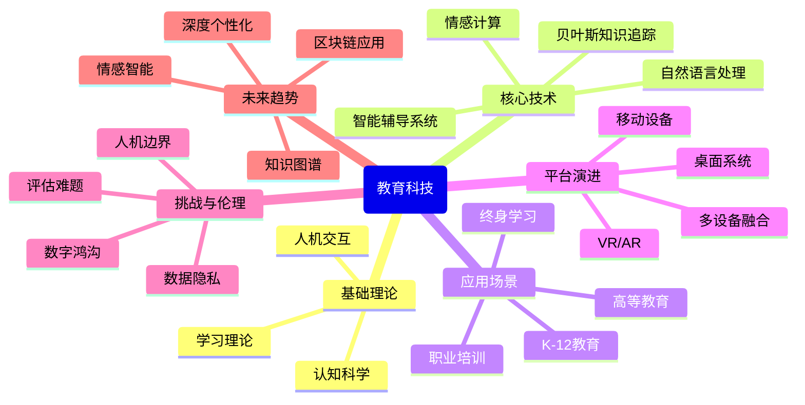

# 计算机科学速成课 Crash Course Computer Science

## 第三十九集 教育科技（Educational Technology）

---

### **核心目标：理解技术如何改变学习方式与教育体验**
- **问题起点**：传统教育"一刀切"模式无法满足个体学习需求
- **关键突破**：**智能辅导系统**实现真正个性化学习
- **核心理念**：**技术不是教育的终点**，而是连接学习者与知识的桥梁

> 💡 **Carrie Anne 的洞见**：  
> *"教育科技不是用机器取代教师，  
> 而是赋予每位学习者'专属导师'——  
> 让教育从'工厂流水线'  
> 变为'定制化成长旅程'！"*

---

### **教育科技的演进历程**
#### 1. **早期计算机辅助教学（1950s-1970s）**
   - **PLATO系统**（1960）：
     - 首个大规模计算机辅助教学系统
     - 包含课程、消息系统、屏幕共享
   - **特点**：
     - 以行为主义理论为基础
     - 程序化教学：分支选择、即时反馈
   - **局限**：
     - 缺乏真正个性化
     - 固定学习路径

#### 2. **智能辅导系统（1980s-1990s）**
   - **关键创新**：引入**领域知识模型**
     - 代表：SCHOLAR（地理学习）、LISP tutor
   - **工作原理**：
     - 建模学科知识结构
     - 检测学生错误模式
     - 提供针对性反馈
   - **突破**：从"程序教学"到"理解学习过程"

#### 3. **现代教育科技（2000s-至今）**
   - **移动学习**：随时随地获取知识
   - **大规模开放在线课程**（MOOCs）：Coursera, edX
   - **自适应学习平台**：Khan Academy, Duolingo
   - **沉浸式技术**：VR/AR教育应用

> ✅ **关键转变**：从"技术辅助教学"到"以学习者为中心的技术"

---

### **个性化学习的核心技术**
#### 1. **智能辅导系统（ITS）**
   - **定义**：模拟人类导师行为的计算机系统
   - **三大组件**：
     | 组件         | 功能             | 示例               |
     | ------------ | ---------------- | ------------------ |
     | **领域模型** | 学科知识表示     | 代数规则库         |
     | **学生模型** | 评估学生知识状态 | 贝叶斯知识追踪     |
     | **教学模型** | 决定教学策略     | 何时提示、何时解释 |
   - **优势**：
     - ✅ 24/7个性化辅导
     - ✅ 即时反馈与指导
     - ✅ 适应不同学习节奏

#### 2. **贝叶斯知识追踪（Bayesian Knowledge Tracing）**
   - **核心思想**：基于概率更新学生知识状态
   - **四个关键概率**：
     | 概率                       | 定义             | 示例        |
     | -------------------------- | ---------------- | ----------- |
     | **初始知识**<br>(P(Learn)) | 学生初始掌握概率 | 新技能：0.1 |
     | **学习率**<br>(P(Learn))   | 掌握技能的概率   | 0.3         |
     | **猜测率**<br>(P(Guess))   | 猜对的概率       | 0.2         |
     | **失误率**<br>(P(Slip))    | 知道但出错的概率 | 0.1         |
   - **工作流程**：
     ```mermaid
     graph LR
     A[学生回答问题] --> B{正确？}
     B -->|是| C[更新：已掌握概率↑]
     B -->|否| D[更新：已掌握概率↓]
     C --> E[调整后续教学]
     D --> E
     ```
   - **应用**：Knewton, Carnegie Learning MATHia

> 💡 **Carrie Anne 的解释**：  
> *"当学生正确解出'7-3=4'，系统不会简单认为'他懂减法'，  
> 而是计算：  
> 1. 他可能真懂了（学习率）  
> 2. 他可能猜对了（猜测率）  
> 3. 他可能懂但粗心错了（失误率）  
> 这就是贝叶斯知识追踪的智慧！"*

---

### **虚拟教学助手与AI导师**
#### 1. **自然语言交互**
   - **技术基础**：
     - 语音识别（第36集内容）
     - 语义理解
     - 对话管理
   - **功能**：
     - 回答问题（"2+2等于几？"）
     - 处理命令（"设2:20的闹钟"）
     - 指导学习过程
   - **局限**：
     - 复杂句式理解困难
     - 情感识别有限
     - 缺乏真正理解

#### 2. **虚拟教学助手的进化**
   - **早期系统**：
     - 规则驱动
     - 有限交互能力
   - **现代系统**：
     - 深度学习驱动
     - 个性化适应
     - 情感感知
   - **未来方向**：
     - 语境理解深化
     - 多模态交互（语音+视觉+手势）
     - 持续学习能力

#### 3. **虚拟教学助手的实例**
   - **Justine Cassell 的研究**：
     - 创建能"展现人类对话行为"的虚拟代理
     - 建立信任、融洽关系甚至友谊
     - 适应学生情绪状态
   - **《钻石时代》的启示**：
     - Neal Stephenson 1995年小说预言
     - 虚拟导师随学生一起成长
     - 检测知识状态与情绪
     - 提供精准反馈和支持

> ✅ **关键数据**：虚拟教学助手可将学习效率提高20-30%，尤其对困难概念效果显著

---

### **教育技术的多平台演进**
#### 1. **从桌面到移动**
   - **传统局限**：
     - 固定学习场所
     - 有限使用时间
   - **移动学习优势**：
     - ✅ 随时随地学习
     - ✅ 碎片时间利用
     - ✅ 个性化推送
   - **挑战**：
     - 屏幕尺寸限制
     - 分心风险增加
     - 深度学习难度

#### 2. **协作式学习环境**
   - **大型桌面设备**：
     - 支持多人同时协作
     - 适合小组项目
     - 可视化共享空间
   - **多点触控技术**：
     - 直观交互
     - 降低技术门槛
     - 促进创造性思维

#### 3. **沉浸式学习体验**
| 技术                 | 教育应用                             | 优势                         |
| -------------------- | ------------------------------------ | ---------------------------- |
| **虚拟现实**<br>(VR) | 深海探索<br>太空旅行<br>历史场景重现 | 完全沉浸<br>安全体验危险环境 |
| **增强现实**<br>(AR) | 3D解剖模型<br>实时翻译<br>互动教科书 | 现实增强<br>无缝学习体验     |
| **混合现实**<br>(MR) | 虚拟实验<br>远程协作<br>技能训练     | 虚实融合<br>互动性更强       |

#### 4. **多设备无缝学习**
   - **连续性体验**：
     - 从手机开始，平板继续，电脑完成
     - 无缝同步学习进度
   - **情境感知**：
     - 根据位置调整内容
     - 适应不同设备能力
   - **个性化路径**：
     - 跨设备学习轨迹整合
     - 统一学生模型

> 💡 **Carrie Anne 的强调**：  
> *"教育技术的未来不是单一设备，  
> 而是**无缝衔接的多设备体验**——  
> 无论你在哪里，  
> 都能继续你的学习旅程！"*

---

### **教育科技的挑战与伦理考量**
#### 1. **数据隐私与安全**
   - **风险**：
     - 学习数据被滥用
     - 个人画像过度构建
     - 敏感信息泄露
   - **解决方案**：
     - 数据最小化原则
     - 透明隐私政策
     - 强化数据加密

#### 2. **数字鸿沟问题**
   - **现状**：
     - 设备获取不平等
     - 网络接入差异
     - 数字素养差距
   - **应对策略**：
     - 公共资源投入
     - 离线功能支持
     - 低带宽优化

#### 3. **学习效果评估**
   - **挑战**：
     - 量化学习成效困难
     - 长期影响研究不足
     - 与传统评估方式不匹配
   - **创新方法**：
     - 多维度评估框架
     - 形成性评价整合
     - 学习过程数据分析

#### 4. **人机协作边界**
   - **关键问题**：
     - 技术应辅助而非替代教师
     - 保持人际互动价值
     - 避免过度依赖技术
   - **健康平衡**：
     - 教师培训与技术整合
     - 混合学习模式设计
     - 保持人性化互动

> ✅ **关键事实**：85%的教育技术失败源于忽视教师需求，而非技术缺陷

---

### **教育科技的未来趋势**
#### 1. **AI驱动的深度个性化**
   - **高级学生模型**：
     - 整合认知、情感、社交维度
     - 预测学习困难点
     - 个性化干预时机
   - **动态内容生成**：
     - 实时生成适配难度的练习
     - 个性化学习路径
     - 语境相关示例

#### 2. **情感智能教育系统**
   - **情感识别**：
     - 面部表情分析
     - 语音情感检测
     - 生理信号监测
   - **情感响应**：
     - 适应学生情绪状态
     - 提供情感支持
     - 避免负面情绪循环

#### 3. **知识图谱与语义网络**
   - **工作原理**：
     - 构建学科概念关系网络
     - 识别知识缺口
     - 提供概念连接
   - **优势**：
     - 超越线性学习路径
     - 促进概念整合
     - 支持探索式学习

#### 4. **区块链教育应用**
   - **学习记录**：
     - 不可篡改的学习历程
     - 跨平台认证
     - 终身学习档案
   - **微认证**：
     - 细粒度技能认证
     - 可验证成就
     - 个性化能力展示

> 💡 **Carrie Anne 的展望**：  
> *"未来的教育科技将不再'适应标准课程'，  
> 而是'适应每个学习者'——  
> 不是让学习者适应系统，  
> 而是让系统适应学习者！"*

---

### **教育科技的设计原则**
#### 1. **以学习者为中心**
   - **关键实践**：
     - 深入理解学习过程
     - 尊重个体差异
     - 关注学习体验
   - **设计检查**：
     - [ ] 是否尊重学习者的自主性？
     - [ ] 是否适应不同学习风格？
     - [ ] 是否提供有意义的反馈？

#### 2. **支持教师而非替代**
   - **赋能教师**：
     - 提供学生洞察
     - 自动化管理任务
     - 增强教学能力
   - **成功指标**：
     - 教师工作负担减轻
     - 教学决策质量提高
     - 个性化教学能力增强

#### 3. **促进深度学习**
   - **避免陷阱**：
     - 表面互动≠深度学习
     - 游戏化≠有效学习
     - 技术炫酷≠教育价值
   - **深度学习特征**：
     - 概念理解而非机械记忆
     - 批判性思维培养
     - 知识迁移能力

#### 4. **包容性设计**
   - **无障碍原则**：
     - 适应不同能力水平
     - 考虑文化背景差异
     - 支持多语言学习
   - **实现策略**：
     - 可调节界面复杂度
     - 多模态内容呈现
     - 个性化辅助功能

> ✅ **关键启示**：教育技术成功的关键不是技术先进性，而是**对学习本质的理解**

---

### **思考与延伸**
#### 1. **教育技术的哲学反思**
   - **知识本质**：技术如何改变我们对知识的理解？
   - **学习本质**：什么是真正的学习？技术如何影响它？
   - **教育目的**：技术应服务于什么教育目标？

#### 2. **教师角色的演变**
   - **从知识传授者** → **学习引导者**
   - **从课堂控制者** → **学习环境设计者**
   - **从评估者** → **成长伙伴**

#### 3. **评估体系的创新**
   - **过程性评估**：关注学习过程而非仅结果
   - **能力导向**：评估实际能力而非记忆
   - **个性化标准**：适应不同学习路径

#### 4. **可持续教育技术**
   - **能效优化**：降低教育技术碳足迹
   - **设备寿命延长**：减少电子垃圾
   - **开源教育工具**：促进资源共享

---

### **教育科技思维导图**


> ✅ **Carrie Anne 的总结**：  
> *"教育科技的真正革命不是技术本身，  
> 而是它如何让教育回归本质——  
> 每个学习者都是独特的，  
> 每个学习旅程都应被尊重。  
> 当技术不再'标准化'学习，  
> 而是'个性化'成长，  
> 我们才能说：  
> 科技真正服务于了教育的使命！"*

---

**课程终章预告**：作为本系列的最后一集，我们将回顾计算机科学的发展历程，探讨技术如何塑造人类文明，并展望数字未来的无限可能！感谢您与我们一同完成这段计算机科学的探索之旅！